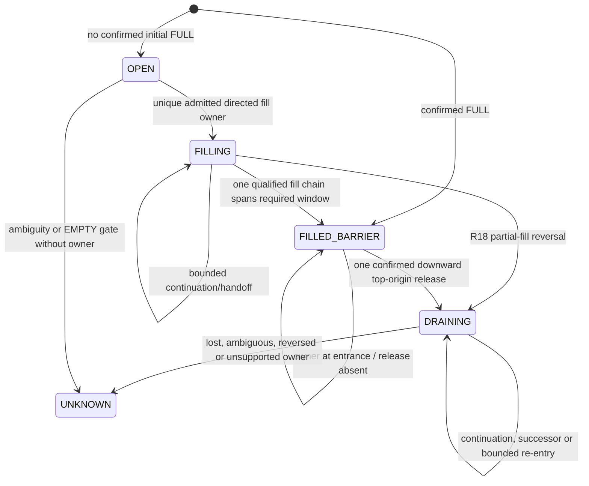

# S11 Current Detector Logic Map

**Scope:** the detector currently on `main` (`opencv-phase-detector-r18-lifecycle-closure-v1`, completed-window resolver `r18-lifecycle-closure-v1`). This is a current control-flow map, not a design history or an R19 proposal. Claims below were checked against the implementation modules linked in each owner row.

**Authority:** current sequencing is in the [work plan](../00-project/work-plan.md); durable detector responsibility is in the [S11 responsibility architecture](s11-detector-responsibility-architecture.md); the failed R18 behavior contract is in the [R18 architecture](s11-r18-lifecycle-closure-architecture.md), while the completed diagnostic-only source addendum is the [causal trace observability architecture](s11-r18-causal-trace-observability-architecture.md). The approved successor is the [R19 bounded drain-release-chain design](s11-r19-bounded-drain-release-chain-architecture.md), which is not implemented here. Those documents describe intent and acceptance boundaries; this file names the implementation that actually executes them.

## Quick start / design index

Read this index completely before opening the detailed flow. Use the stable IDs to select the smallest relevant reading set; the detail sections remain mandatory for every selected node.

| Pipeline group | Route at a glance | Node IDs to scan first |
|---|---|---|
| Input / evidence | decoded frame → bounded ROI, preprocessing, Oil evidence and Foam evidence | `FRAME-EVIDENCE`, `OIL-RAW-EVIDENCE`, `OIL-PROPOSAL`, `OIL-HYPOTHESIS`, `FOAM-CANDIDATE` |
| Oil authority / identity | candidates → typed authority → directed physical owner | `OIL-CANDIDATE`, `OIL-AUTHORITY`, `OIL-TRACKLET` |
| Lifecycle / selection | physical rows → initial/fill/drain ownership → fixed-lag selected node → same-frame projection | `OIL-PHASE-INITIAL`, `OIL-PHASE-FILL`, `OIL-PHASE-DRAIN`, `OIL-SELECTOR`, `OIL-PROJECTION` |
| Foam | candidate/material identity → bounded episode formation, after Oil projection | `FOAM-IDENTITY`, `FOAM-EPISODE`, `SEQUENCE-COMPOSITION` |
| Publication / presentation | final detections → samples/events, CSV/trace, graph/report/UI | `PUBLICATION-PROVENANCE`, `CSV-PUBLICATION`, `TRACE-PUBLICATION`, `RESULT-PRESENTATION` |

### Hard-gate hotspots

- Evidence availability, raster/shape/resource bounds, and typed no-interface conditions: `FRAME-EVIDENCE`, `OIL-RAW-EVIDENCE`, `OIL-HYPOTHESIS`.
- Authority, physical identity, and phase admission: `OIL-AUTHORITY`, `OIL-TRACKLET`, `OIL-PHASE-INITIAL`, `OIL-PHASE-FILL`, `OIL-PHASE-DRAIN`.
- Publishability, same-frame provenance, and independent Foam acceptance: `OIL-SELECTOR`, `OIL-PROJECTION`, `FOAM-EPISODE`, `PUBLICATION-PROVENANCE`.
- Composition and serializers cannot repair upstream rejection: `SEQUENCE-COMPOSITION`, `CSV-PUBLICATION`, `TRACE-PUBLICATION`, `RESULT-PRESENTATION`.

### If changing X, read these nodes

| Change focus | Required node detail |
|---|---|
| ROI, preprocessing, candidate families, evidence availability, or thresholds | `FRAME-EVIDENCE`, `OIL-RAW-EVIDENCE`, `OIL-PROPOSAL`, `OIL-HYPOTHESIS`, `OIL-CANDIDATE`, plus any affected `FOAM-CANDIDATE` path |
| Oil authority, track identity, handoff, confirmation, or ambiguity | `OIL-AUTHORITY`, `OIL-TRACKLET`, and the affected lifecycle nodes (`OIL-PHASE-INITIAL`, `OIL-PHASE-FILL`, `OIL-PHASE-DRAIN`) |
| Initial state, fill/drain transitions, owner loss, or selection | `OIL-PHASE-INITIAL`, `OIL-PHASE-FILL`, `OIL-PHASE-DRAIN`, `OIL-SELECTOR`, `OIL-PROJECTION` |
| Foam material, formation, episode association, or Oil/Foam ordering | `FOAM-CANDIDATE`, `FOAM-IDENTITY`, `FOAM-EPISODE`, `SEQUENCE-COMPOSITION` (and any Oil node explicitly touched) |
| Samples, events, CSV, traces, graphs, reports, or UI semantics | `PUBLICATION-PROVENANCE`, the relevant publication node(s), and `RESULT-PRESENTATION` |

This index routes reading; it does not add an owner, alter current behavior, or propose R19.

## 1. End-to-end control flow

There are two related paths. The online path produces one current-frame `PhaseDetection` and compatibility/debug fields. The completed-window path reruns ownership over all successful detections before official samples are made. The latter is the authority for completed analysis.

```mermaid
flowchart LR
  V[decoded frame] --> E[FRAME-EVIDENCE\nROI + preprocess + current evidence]
  E --> OC[OIL-CANDIDATE\nOil hypotheses + proposal families]
  E --> FC[FOAM-CANDIDATE\nraw Foam front + motion/material features]
  OC --> A[OIL-AUTHORITY\nphase identity + authority tiers]
  FC --> FI[FOAM-IDENTITY\nobservation-only material track]
  A --> T[OIL-TRACKLET\nbounded directed physical IDs]
  T --> P0[OIL-PHASE-INITIAL]
  P0 --> PF[OIL-PHASE-FILL]
  PF --> PD[OIL-PHASE-DRAIN]
  PD --> S[OIL-SELECTOR\nbounded fixed-lag path]
  S --> OP[OIL-PROJECTION\nselected same-frame candidate]
  OP --> C[SEQUENCE-COMPOSITION\nOil/state then Foam]
  FC --> FE[FOAM-EPISODE\ntracks + formation witness]
  FI --> A
  FE --> C
  C --> PP[PUBLICATION-PROVENANCE\nTrackingSample / events / judgment]
  PP --> RP[RESULT-PRESENTATION\ngraph / report / review UI]
  PP --> CP[CSV-PUBLICATION\ntracking + events CSV]
  PP --> TP[TRACE-PUBLICATION\nraw + sequence trace]
```



The exact completed-window call is:

```text
OpenCvPhaseDetector.resolve_sequence
  -> ObservationSequenceResolver.resolve
       -> OilObservationResolver.resolve
            -> OilAdmissionEvidenceOwner.prepare
            -> OilTrackletOppositionOwner.resolve
            -> OilPathLifecycleOwner.resolve
                 -> OilMaterialPhaseLifecycleOwner.resolve
                 -> BoundedOilInterfaceSelector.resolve
                 -> OilResolutionProjectionOwner.project
       -> FoamEpisodeResolver.resolve (on Oil-projected detections)
  -> DetectionRunCoordinator.resolve_completed_window
  -> tracking_sample_from_detection
  -> StateAwareOutcomeAssembler (events/judgment)
  -> OutputBundleStore (CSV, graph/report, debug assets)
```

`DetectionRunCoordinator` requires one successful detection per target in completed-window mode, preserves Glass/frame/timestamp identity, and replaces each observation's `resolved_detection` with the sequence result. A resolver cardinality or identity change raises instead of silently publishing it.

## 2. Stable node registry

The IDs in this table are the cross-reference surface for future designs and failure records. They name current owners, not desired seams.

| ID | Current owner and entry points | Inputs → outputs | Gate type and behavior |
|---|---|---|---|
| `FRAME-EVIDENCE` | [`OpenCvPhaseDetector.detect`](../../src/oil_tracker/adapters/vision/opencv_phase_detector.py), [`CurrentFrameEvidenceOwner.observe`](../../src/oil_tracker/adapters/vision/phase_frame_detection.py) | Frame + Glass ROI/settings → `MaskBundle`, `PreprocessResult`, static maps, Oil outcome/projection, Foam raster/coherence, registered Oil/Foam motion, temporal Foam decision, assembled candidates | Hard raster/shape/availability checks fail closed. Current-frame state/smoothing is compatibility output; it is not completed-window ownership. |
| `OIL-RAW-EVIDENCE` | [`extract_raw_observations`](../../src/oil_tracker/adapters/vision/oil_shadow_observations.py) | Preprocessed gray/Sobel/Canny/region profiles + effective mask → bounded immutable raw edge observations | Hard resource bounds: `OilShadowBounds` caps source observations and retains no unbounded evidence. Missing polarity/visibility remains unavailable rather than a measured zero. |
| `OIL-PROPOSAL` | [`build_bounded_proposals`](../../src/oil_tracker/adapters/vision/oil_shadow_observations.py) | Raw observations → bounded Y proposals (diameter/member/proposal limits) | Hard bounded grouping; no Oil authority. |
| `OIL-HYPOTHESIS` | [`evaluate_semantic_hypotheses`](../../src/oil_tracker/adapters/vision/oil_shadow_observations.py), [`OilHypothesisPipeline.run`](../../src/oil_tracker/adapters/vision/oil_shadow_pipeline.py) | Proposals + broad/narrow/static/optics evidence → semantic hypotheses and typed current observation (`boundary`, `no_interface`, `ambiguous`, or `unavailable`) | Hard current-frame no-interface, glare/exclusion/border/unavailable conditions can block numeric authority. Soft ranking/margins choose among otherwise observable evidence. Spatial fallback is bounded and only evidence; it does not create authority. |
| `OIL-CANDIDATE` | [`assemble_phase_candidates`](../../src/oil_tracker/adapters/vision/phase_candidate_assembler.py), [`project_production_result`](../../src/oil_tracker/adapters/vision/oil_hypothesis_projection.py) | Primary Oil hypotheses plus material/raster-material, distributed Sobel, calibrated-high-recall, phase-transition families → typed `BoundaryCandidate` rows with features/penalties/provenance | Candidate assembly is additive and bounded. `sequence_eligible` is a per-candidate eligibility gate, not publication. Artifact templates reject matching geometry; calibration/high recall does not grant identity. |
| `FOAM-CANDIDATE` | [`detect_bottom_connected_foam`](../../src/oil_tracker/adapters/vision/foam_front_detector.py), `CurrentFrameEvidenceOwner.observe/project` | ROI/preprocess/effective mask + Foam motion/static maps → raw Foam front candidate and material/topology/optics/dynamic features | Hard candidate eligibility includes coherence, static opposition, glare and component phenotype. The same gate result and failed predicates are trace diagnostics. Raw/rejected candidates remain diagnostics; no Oil masking or Oil selection authority. |
| `FOAM-IDENTITY` | [`track_foam_material_identity`](../../src/oil_tracker/adapters/vision/foam_material_identity.py) called by `OilAdmissionEvidenceOwner._candidate_refs` | Eligible Foam rows plus material-path Oil rows → bounded upper material row, seed age, candidate opposition and lower-reserve annotations | Observation-only. It may oppose an Oil candidate or expose an ordered-lower reserve; it cannot publish Foam/Oil/state or veto every lower row. Missing duration and drift clear the identity. |
| `OIL-AUTHORITY` | [`evaluate_phase_identity`](../../src/oil_tracker/adapters/vision/oil_phase_identity.py), [`evaluate_candidate_authority`](../../src/oil_tracker/adapters/vision/oil_candidate_authority.py), [`OilAdmissionEvidenceOwner._candidate_refs`](../../src/oil_tracker/adapters/vision/oil_observation_resolver.py) | Same-frame candidate/evidence + Foam material identity + representation/corridor support → `OilCandidateRef` with phase identity and tier (`HARD_INVALID`, `CANDIDATE_ONLY`, `CONTINUATION_ELIGIBLE`, `ANCHOR_ELIGIBLE`) | Hard invalid removes the ref. Authority is tiered, not a score-only decision. Material conflict, artifact/optics/ambiguity, unavailable evidence and opposed material are explicit gates. Candidate-only rows can remain for diagnostics but cannot enter the physical owner chain. |
| `OIL-TRACKLET` | [`DirectedInterfaceTrackletBuilder.resolve`](../../src/oil_tracker/adapters/vision/oil_interface_tracklets.py), called by `OilTrackletOppositionOwner.resolve` | Per-frame admitted refs → same-frame row hypotheses, one-to-one bounded directed tracklets, confirmation/lifecycle evidence, updated refs | Hard physical identity constraints: bounded jump/prediction, representation bridge, one-to-one assignment, split/crossing ambiguity termination, bounded loss. Confirmation uses bounded windows and anchor/trajectory/motion profiles. No IDs merge across handoff. |
| `OIL-PHASE-INITIAL` | [`OilMaterialPhaseLifecycleOwner.resolve`](../../src/oil_tracker/adapters/vision/oil_phase_lifecycle.py), policy from [`_material_phase_policy`](../../src/oil_tracker/adapters/vision/oil_observation_resolver.py) | Tracklet-backed phase rows + confirmed initial state → initial `OPEN` or R18 `FILLED_BARRIER`; per-frame allowed tracklet IDs | Hard confirmed `EMPTY_NO_INTERFACE` gate: before a unique dynamic lower-entry owner, allowed IDs are empty. Hard confirmed `FULL_NO_INTERFACE` barrier starts with no fabricated owner and no numeric Oil. `AUTO`/unconfirmed does not become a coordinate. |
| `OIL-PHASE-FILL` | `OilMaterialPhaseLifecycleOwner._advance_fill_chains`, `_fill_confirmation_profile`, `_fill_phase_reentry` | Admitted physical rows + bounded history → `FILLING` chains, one confirmed fill owner, or ambiguity/unknown | Fill requires compatible directed ownership; initial EMPTY requires lower-entry upward evidence. Established chains can survive bounded loss and re-enter only with a unique compatible, material-clean row. Handoff appends IDs; it never copies coordinates/extrema. |
| `OIL-PHASE-DRAIN` | `OilMaterialPhaseLifecycleOwner` barrier/release/continuation methods: `_drain_release`, `_partial_fill_drain_release`, `_drain_successor`, `_drain_phase_reentry` | Filled barrier or established partial fill + confirmed downward rows → `DRAINING` owner chain and allowed IDs | R18 confirmed FULL releases exactly one confirmed downward top-origin/material-supported row. R18 established partial fill may reverse to drain only with confirmed direction/progress, ordinary jump, complete material support, and no competing release. The typed release evaluation is also serialized with ordered predicates and first failure. Ambiguous/lost releases fail closed; drain IDs stay distinct. |
| `OIL-SELECTOR` | [`build_interface_layers`](../../src/oil_tracker/adapters/vision/oil_interface_selector.py), [`BoundedOilInterfaceSelector.resolve`](../../src/oil_tracker/adapters/vision/oil_interface_selector.py) | Phase rows + publishable row members + state/unknown nodes + allowed IDs/owner chains → one node per sampled frame | Hard phase admission and publishability filters precede selection. Soft emission/transition scores use a six-frame lookahead; same-track or explicit adjacent owner-chain handoffs only. Competing physical owners inside ambiguity margin become `UNKNOWN`. Selector cannot select a nonpublishable member. |
| `OIL-PROJECTION` | [`OilResolutionProjectionOwner.project/_project_detection`](../../src/oil_tracker/adapters/vision/oil_observation_resolver.py) | One selected node + original detection/candidates + lifecycle/tracklet metadata → projected `PhaseDetection` | Hard provenance: numeric Oil uses the selected candidate's own Y in that frame; state/unknown nodes carry no coordinate. Projection only rewrites fields/flags/metrics and cannot invent/carry/interpolate. |
| `FOAM-EPISODE` | [`FoamEpisodeResolver.resolve`](../../src/oil_tracker/adapters/vision/foam_episode_resolver.py) | Oil-projected detections + eligible Foam candidates → one-to-one Foam-front tracks, dynamic segments, confirmed Foam projections | Runs after Oil/state and cannot change Oil. Hard episode acceptance needs ≥2 dynamic observations, material/coherence/static gates, and R18 bounded formation: upward front displacement/agreement or bounded stable layer away from top with required extent/footprint. Trace-only track/segment IDs and the same acceptance/formation predicate results are additive diagnostics. Repeated final-Oil same-boundary alias rejects; separated Oil does not. |
| `SEQUENCE-COMPOSITION` | [`ObservationSequenceResolver.resolve`](../../src/oil_tracker/adapters/vision/observation_sequence_resolver.py) | Completed detections + Glass + confirmed initial state → final per-frame detections and diagnostics | Exactly one composition point: Oil/state first, Foam second. Foam remains independently publishable when Oil is unknown; final Oil-only same-boundary relation is used for aliasing. |
| `PUBLICATION-PROVENANCE` | [`tracking_sample_from_detection`](../../src/oil_tracker/application/services/detection_processing.py), [`StateAwareOutcomeAssembler.assemble`](../../src/oil_tracker/application/services/analysis_outcome.py) | Final detections → `TrackingSample`, events, judgment, coverage | Hard sample validity requires confidence plus explicit state/visible observation semantics. `oil_is_valid` and `foam_is_valid` are independent; events/judgment consume observed samples and cannot repair detector output. |
| `RESULT-PRESENTATION` | [`GraphRenderer.render`](../../src/oil_tracker/adapters/reporting/graph_renderer.py), [`build_report_presentation`](../../src/oil_tracker/application/services/report_presentation.py), [`build_review_graph_model`](../../src/oil_tracker/application/services/review_graph.py), [`ResultReviewGraph`](../../src/oil_tracker/ui/widgets/result_review_graph.py) | Final result/review samples + events → graph trajectories, report landmarks/notes, and Result Review graph model/UI | Presentation-only. It reads stored observed values and per-series validity; graph gap bridges and labels do not create samples, CSV values, events, or detector history. |
| `CSV-PUBLICATION` | [`CsvExporter.export`](../../src/oil_tracker/adapters/reporting/csv_exporter.py), invoked by [`OutputBundleStore.write_bundle`](../../src/oil_tracker/adapters/storage/output_bundle_store.py) | `AnalysisResult` samples/events → `tracking_data.csv` and `events.csv` in temporary then committed bundle | Serialization only. CSV raw Y/px/mm and flags come from final `TrackingSample`; no candidate reread or coordinate repair. Bundle validation/atomic publication happens downstream. |
| `TRACE-PUBLICATION` | [`JsonlDebugTraceWriter.write/annotate_sequence/finalize`](../../src/oil_tracker/adapters/storage/jsonl_debug_trace_writer.py) | Current-frame detection/artifacts → JSONL raw records/images; completed sequence → compact `sequence` annotations including causal Oil/Foam predicate diagnostics; finalize → indexed trace | Debug is non-authoritative. `write` records current-frame candidates and metrics; `annotate_sequence` adds final sequence snapshots only for captured records. Additive schema `r18-field-causal-observability-v1` records decisions but cannot publish or alter official samples. |

## 3. Current frame: evidence acquisition and provisional projection

`FRAME-EVIDENCE` is deliberately broader than the completed-window owner. [`CurrentFrameEvidenceOwner.observe`](../../src/oil_tracker/adapters/vision/phase_frame_detection.py) executes, in order:

1. `build_mask_bundle` creates crop, ellipse, exclusions and effective mask; `preprocess` creates gray/normalized/blurred/Sobel/Canny/horizontal/glare evidence.
2. `OpenCvPhaseDetector._evaluate_oil_pipeline` runs the serialized `OilHypothesisPipeline`. It extracts bounded raw observations, groups bounded proposals, evaluates semantic hypotheses, emits typed current observation, optionally runs Spatial fallback for ambiguity/accepted Foam context, then reduces a bounded temporal beam. [`project_production_result`](../../src/oil_tracker/adapters/vision/oil_hypothesis_projection.py) exposes hypothesis rows as Oil candidates and marks only the pipeline-selected hypothesis as current-frame selected.
3. A selected Oil candidate is independently checked against configured Artifact templates. A match clears the current selected value and records calibrated-artifact rejection.
4. `detect_bottom_connected_foam` computes Foam mask/material/topology/optics features; coherence and registered Foam/Oil motion are computed independently. `assemble_phase_candidates` enriches the Oil candidates and appends its bounded candidate families.
5. Static Foam overlap and `FoamTemporalGate.evaluate` create a current Foam candidate; Artifact templates may reject that candidate.
6. `CurrentFrameResultProjector.project` classifies compatibility fill state, applies the online `TemporalTracker` to raw Oil/Foam coordinates, computes px/mm fields, attaches candidates/flags/metrics and returns a `PhaseDetection`.

The tracker’s `raw_*`/`smoothed_*` fields and the current `fill_state` are not the completed-window selection. The completed resolver uses the stored candidates and detection evidence again. The accepted-Foam context parameters exist in the Oil pipeline API, but the current `observe` call runs Oil before it has a current accepted Foam component and therefore invokes it without that context.

## 4. Completed-window Oil path

### 4.1 Candidate normalization and authority (`OIL-CANDIDATE`, `FOAM-IDENTITY`, `OIL-AUTHORITY`)

`OilObservationResolver.resolve` first builds one `OilCandidateEvidenceIndex`, then `OilAdmissionEvidenceOwner.prepare` normalizes every finite `OIL_AIR` candidate. It computes bounded Foam material identity, ordinary semantic anchor/corridor support, cross-representation support and phase identity before calling `evaluate_candidate_authority`.

The authority tiers have these meanings in the current code:

- `HARD_INVALID`: fails `candidate_is_eligible` (explicit sequence eligibility, visibility/evidence availability, Artifact match, optics/exclusion/border conflict); the ref is discarded.
- `ANCHOR_ELIGIBLE`: independently identified direct/ordered-lower/phase/material candidate satisfying one of the explicit authority routes.
- `CONTINUATION_ELIGIBLE`: eligible material/boundary continuation that is not independently anchor-grade.
- `CANDIDATE_ONLY`: retained only when later bookkeeping needs it; it cannot be phase-admitted.

Per frame, ordinary refs are sorted by authority/quality/Y/source and limited by configured `candidate_top_k`; a non-calibrated supplemental row, bounded calibrated-high-recall reserve, and one ordered-lower reserve can be retained. This reserve affects evaluation capacity, not identity authority. Material identity opposition is bounded (missing/seed-age/drift limits) and is not the same as a final Foam episode.

### 4.2 Physical identity (`OIL-TRACKLET`)

`DirectedInterfaceTrackletBuilder.resolve` groups same-frame eligible refs into row hypotheses (`oil-row:<frame>:<ordinal>`), then matches them to only bounded active tracklets (`oil-tracklet:<frame>:<ordinal>`). Match cost uses bounded frame gap, jump/prediction error, representation overlap/bridge, reversal and quality. Established-parent/child ambiguity is symmetric; ambiguous branch identities terminate and involved frame hypotheses are incompatible. Confirmed evidence is found in a bounded six-frame window using `ANCHOR_CORRIDOR`, `ANCHOR_TRAJECTORY`, or `MOTION_TRAJECTORY`; later observations are `CONTINUING` only while bounded anchor/motion evidence remains. Loss is bounded, and a tracklet never silently merges across a phase handoff.

The builder writes tracklet ID, row hypothesis ID, lifecycle, admission, confirmation profile/support, direction, progress, motion, material conflict, incompatibility and failure reason back into every member ref. A ref with no confirmed/continuing physical proof remains non-publishable even if its current-frame emission is high.

### 4.3 Material phase ownership (`OIL-PHASE-INITIAL`, `OIL-PHASE-FILL`, `OIL-PHASE-DRAIN`)

`OilPathLifecycleOwner.resolve` makes phase layers from refs, then runs `OilMaterialPhaseLifecycleOwner` over physical rows. The lifecycle returns a phase, reason, owner chain and allowed physical-ID set for every frame; `None` means unconstrained ordinary selection, singleton means one owner, and empty means the selector must fail closed.

Current state transitions:



R18-specific behavior is source-backed by the lifecycle methods and policy construction:

- Confirmed FULL is passed into `OilMaterialPhasePolicy`; the loop starts `FILLED_BARRIER` with no fabricated owner. `_drain_release` requires a confirmed, compatible downward tracklet with progress/directional agreement, top-origin entrance ratio and strict material support.
- Confirmed EMPTY keeps the initial lower-entry gate. Until `established_fill_chain` exists, `allowed_tracklet_ids=frozenset()` blocks stationary lower structure, mid-Glass rows and downward candidates.
- Once a unique fill chain is established, `_partial_fill_drain_release_choice` can transfer to `DRAINING` if exactly one current row satisfies `_partial_fill_drain_release`: confirmed physical evidence, downward direction/progress/agreement, ordinary jump/reversal bound and strict current/history material support. The new drain ID is appended; no observation or coordinate is copied.
- Existing drain continuation, successor handoff, loss and phase re-entry remain bounded and material-checked. Ambiguity returns an empty allowed set and marks the frame ambiguous.

### 4.4 Bounded selection and same-frame projection (`OIL-SELECTOR`, `OIL-PROJECTION`)

`build_interface_layers` creates two layers per frame: phase-oil plus state/unknown nodes for lifecycle reasoning, and publishable Oil members plus state/unknown nodes for final selection. `BoundedOilInterfaceSelector.resolve` first filters each layer by the lifecycle’s allowed IDs, then scores a six-frame lookahead. Oil transitions require the same tracklet or an adjacent ID in the explicit owner chain. Competing physical owners inside `ambiguity_margin` produce an unknown node. `assert_publishable_path` asserts that every chosen Oil member passes phase admission, tracklet admission, trajectory support and candidate confidence (or the explicit continuing-anchor witness).

`OilResolutionProjectionOwner._project_detection` turns one node into one final `PhaseDetection`:

- `oil`: selected candidate Y is copied to raw/smoothed/public Oil fields for that source frame; state is derived from the selected Oil path; sequence and tracklet provenance are added to metrics.
- `full`/`empty`: image-supported state is emitted with no Oil coordinate.
- `unknown`: no Oil coordinate; barrier/initial-state/tracklet reasons are retained in flags/metrics.

The projection uses the selected nested candidate, not a path-interpolated Y. The current code’s compatibility flags still use several `R17_*` names while the resolver/version is `r18-lifecycle-closure-v1`; those labels are storage/readability details, not an alternate R17 owner.

## 5. Independent Foam path and composition

`ObservationSequenceResolver` passes the Oil-projected detections to `FoamEpisodeResolver`; it does not feed Foam back into Oil selection. `FOAM-CANDIDATE` evidence is selected from a `FOAM_FRONT` candidate carrying `sequence_foam_eligible`. `_foam_front_tracks` links candidates only within bounded frame/time/Y/extent compatibility. `_foam_confirmation_segments` keeps dynamic observations (`min(internal_motion, dynamic_support) >= 0.15`) in bounded segments.

`_foam_segment_accepted` requires at least two observations, material support, coherence, at least two dynamic observations with a dynamic-frame ratio, non-static-dominance, and `_foam_formation_witness`:

- directed formation: first front Y minus last front Y reaches the geometry-scaled rise and a majority of consecutive steps are upward within jitter tolerance; or
- bounded stable layer: front remains away from the top entrance and spatially bounded, with at least three observations or a two-observation substantial area-and-width footprint, plus area/width evolution.

Static-dominated, unconfirmed and repeated same-boundary Oil-alias episodes are rejected. A distinct lower Oil layer does not bypass the witness, an inverted topology is diagnosed at projection, and no resolved Oil is allowed as a prerequisite for a confirmed Foam episode. On confirmation, the selected Foam candidate’s own Y becomes `raw_foam_front_y`/public Foam fields for that frame. Composition maps confirmed Foam to `FOAMING_VISIBLE`, `FULL_WITH_FOAM`, or `UNKNOWN_REVIEW` according to the Oil/state result; it does not revise Oil Y.

## 6. Publication, provenance, and validation invariants

The durable invariants observable in current code are:

1. Completed-window cardinality and Glass/frame/timestamp identity are unchanged by resolution.
2. Every numeric Oil value has one selected same-frame Oil candidate; every numeric Foam value has one selected same-frame Foam candidate.
3. Selected candidate Y, sequence raw Y, and CSV raw Y are equal for the corresponding series. px/mm values are derived from that Y and the Glass zero line/calibration.
4. No resolver stage interpolates, carries or synthesizes an Oil/Foam coordinate. A censored spike or gap becomes unknown; graph bridges are presentation-only endpoints.
5. Oil and Foam validity are independent (`TrackingSample.oil_is_valid` vs `foam_is_valid`); legacy `is_valid` follows Oil/state validity for event/judgment semantics.
6. Events/judgment consume observed final samples. Retrospective state interpretation can annotate downstream outcomes but cannot rewrite detector observations.
7. Debug trace is evidence/provenance only: current records are written during acquisition, then captured records receive a compact final `sequence` snapshot during `annotate_sequence`; this does not alter `AnalysisResult` samples.
8. Result presentation, CSV and bundle publication serialize or render the final `AnalysisResult`; `OutputBundleStore` writes to a temporary bundle, copies finalized debug staging, validates required files, and commits the bundle. Presentation and export code do not reread candidates.

## 7. Current R18 scope boundaries and named unknowns

### Current boundaries

- R18 changes lifecycle initial-state ownership, established partial-fill reversal and bounded Foam-front formation. Candidate generation, authority thresholds/top-k, directed tracklet construction, selector ordering, same-frame projection, CSV mapping and graph semantics are otherwise current baseline responsibilities.
- One detector serves every Glass. No filename, Glass ID, timestamp, reviewed coordinate or truth annotation is consulted by production detector control flow.
- The online `TemporalTracker` remains for current-frame compatibility and preview fields; completed-window Oil/Foam owners are the official analysis path.
- Graph code may draw a lower-emphasis bridge between observed Oil runs, but the bridge is not a sample, CSV value, event, capture guide or detector history.

### Frozen R18 causal result and named unknowns

The completed transferred causal rerun confirms the implementation-current R18
result while leaving the detector field disposition unchanged:

- Base remained in `INITIAL_FULL_BARRIER`; rapid-refill Oil presence was `0`
  (`FAIL`). The operational `Y <= 800` cohort had 245 release-evaluation rows
  and zero passed. Lower `Y > 800` entrance rejection is correct safety
  behavior, while the actual interface's earliest harmful stage is
  before-or-at `OIL-PHASE-DRAIN` and remains `NOT_PROVEN`.
- Accum DRAIN produced 264 release-evaluation rows and zero passed. Retained
  owner `000388:0265` remained a non-updated established snapshot; its
  non-update cause and actual drain candidate identity/direction remain
  unknown. The owner-bounded selector abstain predicate is also unknown.
- Foam exact eligibility and formation gates are closed by the rerun, with
  seven known false ENTRY-SPLASH paths. Foam remains intentionally outside the
  approved R19 design.
- Compared selected-candidate, completed-sequence and CSV fields were
  invariant on `1,202/1,202` common rows with zero mismatches. No further
  Windows diagnostic rerun is required for R19 design input.

The four frozen diagnostic unknowns are:

1. Base actual interface first loss.
2. Accum snapshot non-update cause and actual drain candidate identity/direction.
3. Owner-bounded selector abstain predicate.
4. Exact reviewed Y anchors.

R19 is pending implementation and local validation; its approved design is
linked above and in the [R19 validation contract](../30-validation/s11-r19-bounded-drain-release-chain-validation.md).
Current-frame online projection and completed-window projection can differ by
design; the raw debug record is not proof of the final sequence result unless
its `sequence` annotation is present. Proposal recall remains an input to
downstream ownership, and a missing candidate cannot be recovered downstream.
Compatibility flag names and some historical metric keys remain in stored
output; this map treats owner calls and current resolver versions as
authority, not a flag prefix alone.

## 8. Update rules

- Update this map only when the current `main` control flow, owner, invariant, version, or publication boundary changes. Verify the changed claim against source first, then update the corresponding [architecture](s11-r18-lifecycle-closure-architecture.md) and/or [validation contract](../30-validation/s11-r18-lifecycle-closure-validation.md) if the durable contract changed.
- Keep project status and field-run disposition in the project authority documents, not here.
- Keep completed replay measurements and audit findings in `docs/60-evidence/`; keep investigations in `docs/50-diagnostics/`. Do not copy historical counts or failed-design chronology into this current map.
- Preserve the stable node IDs above. If an owner is split or renamed, retain the old ID as a compatibility alias in the replacement section and link the source owner; do not silently reuse an ID for a different responsibility.
- Recheck all relative source/doc links and run `git diff --check` before publishing an update. This file must remain the single current logic map under `docs/20-architecture/`.

## 9. Source owners checked

The implementation review covered: `opencv_phase_detector.py`, `phase_frame_detection.py`, `preprocessing.py`, `geometry_masks.py`, `oil_shadow_pipeline.py`, `oil_shadow_observations.py`, `oil_hypothesis_projection.py`, `phase_candidate_assembler.py`, `foam_front_detector.py`, `foam_material_identity.py`, `oil_candidate_evidence.py`, `oil_phase_identity.py`, `oil_candidate_authority.py`, `oil_observation_resolver.py`, `oil_interface_tracklets.py`, `oil_phase_lifecycle.py`, `oil_interface_selector.py`, `foam_episode_resolver.py`, `observation_sequence_resolver.py`, `detection_run.py`, `detection_processing.py`, `analysis_pipeline.py`, `analysis_outcome.py`, `csv_exporter.py`, `output_bundle_store.py`, `jsonl_debug_trace_writer.py`, `graph_renderer.py`, `graph_series.py`, `report_presentation.py`, `review_graph.py`, and `result_review_graph.py`.
