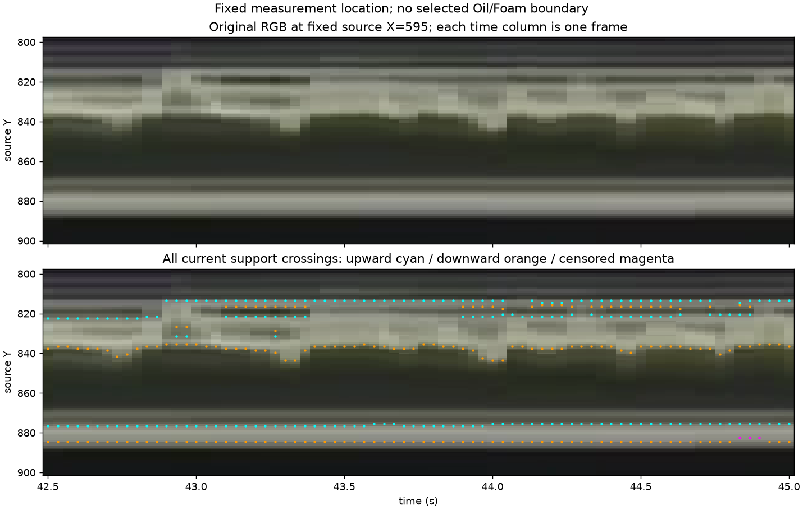
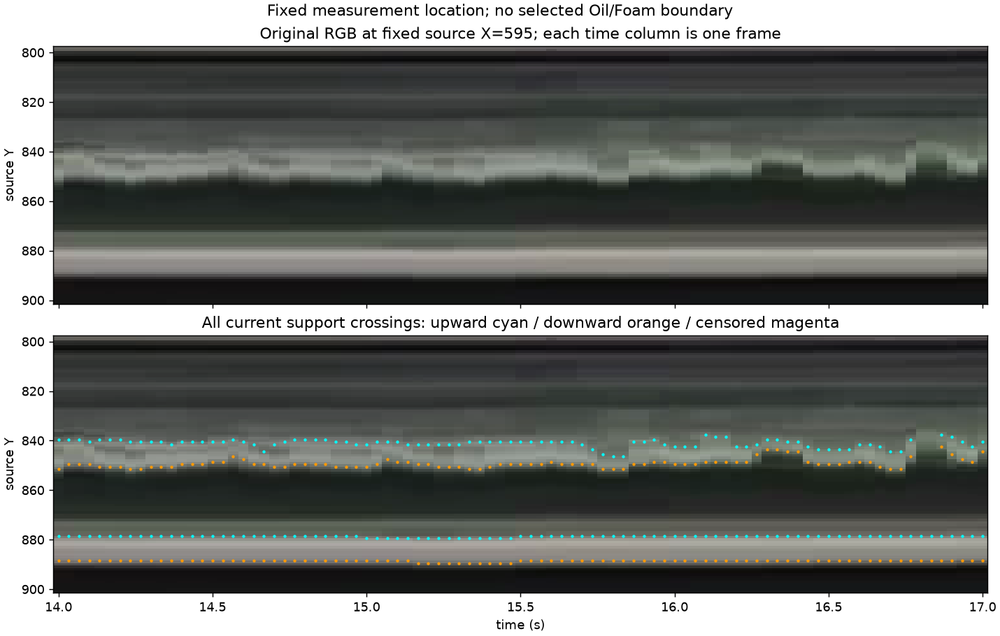

# Fixed-center height choice and saved-array readout — 2026-10-09

Base: `67d2ad3959fd2e912b485cf0c336be0f5e7145e5`. The
[user direction](2026-10-09-fixed-center-choice.json) is interpreted as choosing
the previously recommended fixed Glass-center target for consistency and simple
implementation. No further product choice is needed for that target. The
[architecture](../../20-architecture/s11-interface-observability-witness-architecture.md#fixed-center-height-target--selected-for-the-offline-challenger)
owns the rule; the [Work Plan](../../00-project/work-plan.md) owns next work.
The [machine record](2026-10-09-fixed-center-readout.json) preserves the frozen
preflight, exact runner, readout, controls and input/output hashes.

## Reuse and scope

Use existing `GlassGeometry.ellipse.center_x`, rounded to the nearest native
column with half ties toward positive X. Sample4's existing Recipe gives X595.
Current surrounding image/temporal evidence may identify a boundary; only the
location at which its height is read is fixed. Oil and Foam remain independent.
An absent or ambiguous current boundary there supplies no numeric height.
Existing px/mm conversion follows eligibility. No setting, tracking engine,
side median, alternate column, interpolation or carried value is added.

The readout reuses `s11_foam_support_geometry.measure_boundary_faces` and saved
capture arrays. A two-condition array filter retains **all** horizontal unit
faces crossing the fixed column. It keeps exact half-pixel source Y, labels,
orientation and visibility status. No permanent helper duplicates that owner.
The existing report source-column image uses a width median, so its pixels are
not used as fixed-column measurements; reporting remains unchanged.

Inputs are the 167 unique sample4 rasters from the prior
[current-perimeter capture](2026-10-09-reference-current-boundary.md), plus nine
native public rasters from the [support-face audit](2026-10-09-retained-support-boundaries.md).
Sample4 covers every frame in 14–17 s and 42.5–45 s. Public locations use their
previously declared diagnostic crop centers (X950/1350/1120), explicitly **not**
newly calibrated Glass centers. These exposed development/regression cases are
not holdouts. No video decoding or detector rerun occurs.

## Verified result

- **176/176 rasters, 792/792 oriented intersections** agree with a separate
  direct column-pixel/neighbor enumeration: 782 visible and 10 censored.
- Five constructed controls pass: multiple intersections retained; side-only
  visibility has no center fallback; masked neighbor stays censored; coordinate
  translation; existing px/mm conversion and missing-value preservation.
- All bound inputs and **221 production Python files** remain hash-identical.
  No source/helper change requires rerunning unchanged unit suites.

| Saved group | Rasters | Visible support crossings per raster | Censored crossings total |
|---|---:|---|---:|
| sample4 | 167 | 2–8 | 3 |
| sample5, water | 3 | 2, 4, 18 | 0 |
| sample6, beer | 3 | 0, 2, 7 | 1 |
| sample7, milk | 3 | 4, 7, 7 | 6 |

These are representation counts, not target recall or false-positive rates.
Even empty-vessel controls contain crossings, and the beer-layer raster has
none at its declared center. Bright-support labels do not identify material.
No Oil/Foam physical-selection rule runs; all role decisions are NOT_EVALUATED.

Each time column is one native source column from one saved frame. Cyan/orange
mean upward/downward support faces; they are **not** Foam/Oil assignments.
Magenta marks censorship. Agent inspection of these plots and the saved whole
crops finds plausible lower fluid-vicinity geometry alongside glass outlines;
early Foam support still mixes/misses the reviewed upper shape. This adds no
human labels or physical subtype claim. Existing material judgments stay closed.

## Disposition

The measurement-location choice and coordinate prerequisite are complete. The
center rule is small enough to reuse current geometry and conversion directly.
It does not solve the still-open physical boundary-selection problem, and raw
component extremities cannot be promoted by choosing their upper/lower face.
Current runtime and W3 original-candidate-Y semantics stay unchanged; the new
target belongs to the next offline challenger. No new review question or Windows
operation is required by this result. Local XY OFF, O2 OPEN and FIELD FAIL remain.

## Detector Governance

- Logic-map nodes: `FRAME-EVIDENCE`, `FOAM-CANDIDATE`, `OIL-PROJECTION`, `PUBLICATION-PROVENANCE`
- Failure-registry entries: `S11-F02`, `S11-F04`, `S11-F07`, `S11-F09`
- First harmful stage: mixed/missing retained appearance support precedes physical selection; exact role-specific loss remains unresolved. A fixed measurement location does not repair it or establish physical scalar accuracy.
- Logic-map impact: NONE — saved arrays and existing geometry/conversion are reused; no runtime owner or integration path changes.
- Failure-registry impact: NONE — the readout preserves already recorded mixed-support and scalar/provenance limits without introducing a new failed detector mechanism.
