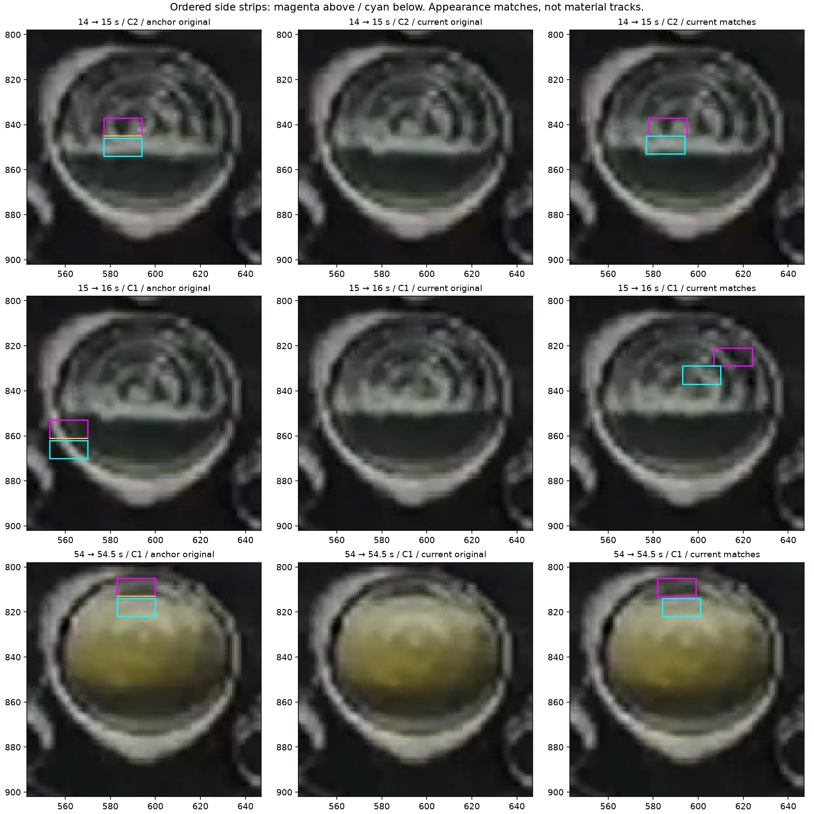

# Ordered two-side appearance transport — 2026-10-09

Base: `c2e4def36eae2378b075a88d4d8cd424f4071451`.
This follows the [closed upper-glass reply and relative-gap check](2026-10-09-foam-gap-local-context.md#human-fixed-structure-reply-and-relative-gap-check).
The [Work Plan](../../00-project/work-plan.md) owns current status.

**Bounded conclusion: CLOSED WITHOUT PROMOTION.** Separately matching the actual
pixel arrangement above and below a proposed edge does not establish physical
correspondence. The confirmed-rim control also passes the differential-transport
comparison and has the same immediate appearance membership as an early mixed
Foam-region query. No physical classifier or production change is adopted.

## Hypothesis and distinct operation

Earlier relative-gap queries lacked correspondence. The older whole-patch matcher
could drift, and pooled plane/step models lost texture arrangement. This experiment
preserves ordered BGR pixels in two separate strips and compares a common 2D
displacement against independent side displacements. Each side has an additive
channel offset; alternating columns fit the displacement/offset and the remaining
columns evaluate it, then the roles swap. There is no fitted error or motion
threshold. Both folds must favor the same model and agree on its relevant shifts.
Ties and inconsistent folds remain unresolved.

The implementation extends the existing offline
`tests/diagnostics/s11_boundary_temporal_probe.py` owner. Source discovery also
found the existing local-arm/contact probe, so that mechanism was not recreated.
The [architecture contract](../../20-architecture/s11-foam-component-diagnostics-architecture.md#offline-two-sided-ordered-appearance-transport)
defines geometry, visibility, resource limits and ambiguity. Even an ideal
piecewise warp of one fixed optical pattern can pass the split comparison;
synthetic tests retain this explicit counterexample. Neither movement nor a
unique appearance minimum is physical identity.

## Frozen real-input scope

Use existing saved rasters at 14/15/16/54/54.5/55.5/56 s. Six ordered frame pairs
are frozen before measurement. For every retained anchor component, divide its
occupied X columns into five ordered sectors and take the middle actual column
of each nonempty sector. Keep every existing gap pair at those Xs, both edges and
both original radii 4/8. Side depth equals the recorded radius; the whole raw
gradient plateau is excluded. Search every contained, completely visible current
placement, without a speed/direction prior. This is bounded workload sampling,
not an all-column or full-sequence efficacy evaluation.

The complete strip/plateau rectangle must be effective and nonglare in both
images. Masked anchors are unavailable, not successful suppression or absent
Foam. No mask expansion or scale retuning follows from missing measurements.
All reviewed interpretations stay at their original regional scope; 54.5 s is
still unreviewed. No human label enters the matcher.

## Results

All **136 distinct queries** are retained in the [machine record](2026-10-09-foam-two-side-transport.json).
These are correlated diagnostic queries, not accuracy trials or material tracks.

| Outcome | Queries | Meaning |
|---|---:|---|
| `SPLIT_BETTER` | 11 | Two shifts predict held-out pixels better in both folds, with stable side shifts |
| `SHARED_MATCH` | 26 | Both side fits choose the same stable shift |
| `COMMON_BETTER` | 2 | Common shift predicts held-out pixels better |
| `FOLD_MATCH_DISAGREEMENT` | 32 | The required best displacement changes between folds |
| `FOLD_DISAGREEMENT` | 20 | The preferred comparison outcome changes between folds |
| `anchor_masked` | 45 | Complete anchor rectangle is unavailable |

The **15→16 s confirmed-rim query**, X561, lower plateau Y[861,862), radius 8,
returns `SPLIT_BETTER`. Its upper strip matches at (+54,−32) and lower strip at
(+40,−33) pixels. Both folds agree. The original/placement figure shows the left
lower rim seed jumping to other upper/right image features. This is an agent
inspection of the correspondence result, not new human truth about those targets.

The **14→15 s mixed-C2 query**, X585, lower plateau Y[845,846), radius 8, also
returns `SPLIT_BETTER`. Both queries have the same saved immediate-side predicate:
raw white entering, clean white entering, no chromatic support on either flank.
Adding those predicates therefore does not resolve this control collision. The
C2 regional review does not certify every strip pixel as Foam, so this is not a
measured true-positive/false-positive rate.

The late 54→54.5 s upper-region query at X591/Y[813,814) also favors split
transport, but its destination remains unreviewed. The reviewed late intervals
provide no complete, validated physical track. Mask absence, equal motion and
fold instability cannot be counted as correct front rejection. No `selected_front`
is produced in any of the 136 queries.

## Arithmetic correction and verification

Review found that direct int64 summation of **scaled held-out residuals** can
overflow on large permitted inputs, even though these small real patches did not.
The correction evaluates aggregate moments using Python integer scaling. A large
opposing-offset test exceeds int64 range and verifies the exact answer. The model,
geometry, comparisons and thresholds are unchanged. Original source snapshots,
preflight and v1 output are preserved; a separately frozen v2 run produces exactly
the same complete 136 comparisons. This is arithmetic repair, not outcome tuning.

- **41 focused tests pass**, including the new 15 checks and existing registered-
  residual/ordered-patch API tests. Translation/exposure, different side shifts,
  optical opposition, ties, masks, poisoned targets, bounds and immutability are covered.
- An independent readout check verifies complete query/component/geometry coverage,
  visibility counts via integral images, and **364 held-out model predictions** by
  directly reconstructing pixels using channel-mean offsets.
- All **73 pinned inputs and 221 production source files** are unchanged during the
  v2 run; v1 pins resolve against its preserved snapshots. All 136 context joins
  preserve source identity and the original appearance fields.
- Detector governance and whitespace checks pass. The document audit passes
  990 local links and 17 named obligations, with protected owners unchanged.
  This experiment does not rerun production acceptance.

The record includes complete comparisons, context joins, preflights, source hashes,
v1 snapshots, verification and reproduction scripts. Expanded artifacts remain in
`sample/output/s11-foam-two-side-transport-20261009-001/`. There was no video
decoding, detector rerun, recipe/label mutation, Windows execution or ML.

## Consequence for subsequent work

Close differential appearance plus immediate material-membership selection for
this frozen comparison. Do not rescue it by adjusting displacement/error cutoffs,
using reciprocal agreement as identity, shrinking around glare, or selecting a
favorable radius. Its independent local matches do not preserve object ownership.

The next design must constrain correspondence using the **spatial relationship
between multiple parts of the same feature**, jointly with independently supported
side roles. It must explicitly reject this rim-to-other-feature jump and retain
the real-front/mixed controls without treating regional labels as exact contours.
A spatial consistency check alone would still not establish physical Foam; retain
the fixed-pattern warp opposition and ambiguous cases. Specify that joint rule
before another real trial or scalar implementation. Existing structure references
remain optional; no new user setup step, pixel-label request or Windows action is
justified by this result. All previous physical questions remain closed.

## Detector Governance

- Logic-map nodes: `FRAME-EVIDENCE`, `FOAM-CANDIDATE`, `FOAM-EPISODE`, `TRACE-PUBLICATION`
- Failure-registry entries: `S11-F02`, `S11-F03`, `S11-F06`, `S11-F07`, `S11-F09`, `S11-F10`
- First harmful stage: this offline match can associate a confirmed-rim seed with other image features before any physical role decision. The diagnostic has no production selector; the first complete physical-front rule remains unknown because neither correspondence nor side ownership is established by its appearance minimum.
- Logic-map impact: NONE — existing offline probe extension has no production caller or publication authority.
- Failure-registry impact: UPDATED — F07 records the two-side transport/control collision and forbids promoting it or its immediate membership conjunction as physical identity.
