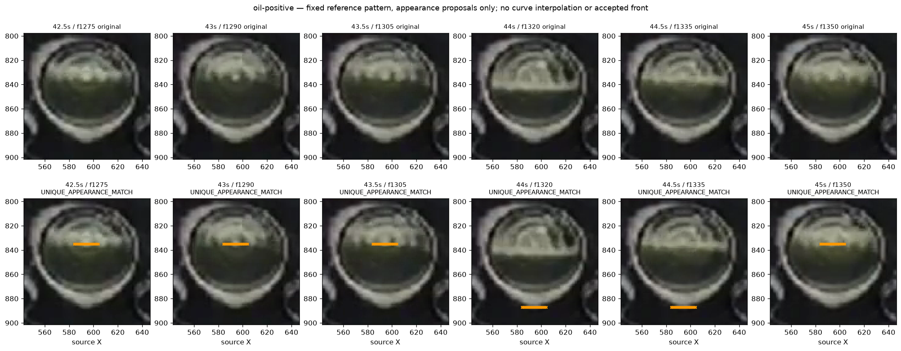
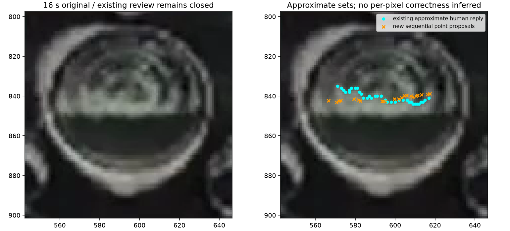
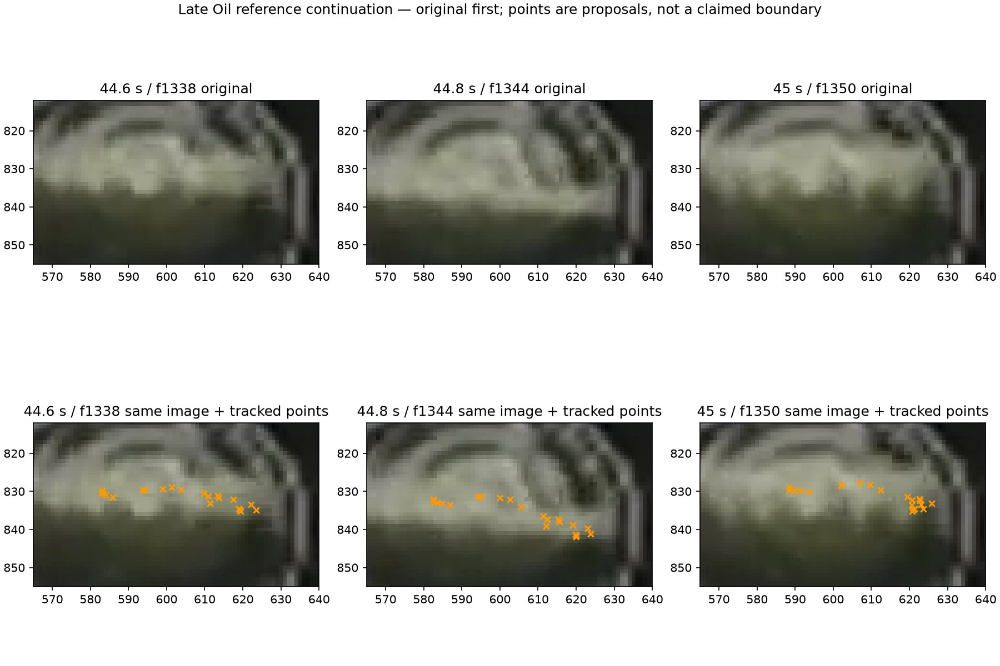

# Optional positive-reference feasibility — 2026-10-09

Base: `f424e34fcc55503c6eb610facc5cc24075e30fe2`. The user chose option B in the
[decision brief](2026-10-09-material-reference-design-choice.md): investigate
optional Oil/Foam initialization offline before a Recipe/UI change. The
[Work Plan](../../00-project/work-plan.md) owns the current transition. The
[machine record](2026-10-09-material-reference-feasibility.json) retains all four
frozen preflights, scripts, input/source pins, output identities and readouts.

**Result:** a correct initial role does not make the tested appearance-transfer
rules reliable physical boundary trackers. Fixed-pattern matching is CLOSED
WITHOUT PROMOTION. Sequential LK improves gross correspondence but preserves
point IDs through partial drift. Neither produces an eligible numeric front.
This does not disprove optional initialization combined with a separately
validated current-frame boundary/role mechanism. No runtime, UI, Recipe, truth
schema, threshold or field disposition changed.

## Inputs, hypothesis and reuse

The new information is an explicitly supplied initial semantic role. Existing
reviewed examples are **declared experimental inputs**, not secretly imported
scoring truth. Their approximate geometry is not an exact contour. Initial
frames are excluded from any continuation claim; all images are exposed
development/regression material, not holdouts.

| Plan | Input and scope | Frames / count |
|---|---|---:|
| Foam positive | All 22 approximate user clicks at sample4 f420, in original order | 420–510 / 91 |
| Oil positive | Previously reviewed central f1275 candidate-center vicinity, source X584–604/Y835; 21 hints, no certified full contour | 1275–1350 / 76 |
| Rim opposition | Previously confirmed Structure seed X561/Y861; one point, explicitly not a complexity-matched positive reference | 450–480 / 31 |

The Foam input comes from the bound two-time human reply; its later f480 points
are withheld from the operations and used only for an attributed qualitative
comparison. The Oil input binds the old central orange-chain reply. That reply
certifies the old displayed 42.5–44 s chain qualitatively; it does not certify a
new LK chain, unshown sectors or later frames. All crops are native 104×104 at
source origin `[543,798]`, derived from existing saved originals. No video decode
or detector execution was needed. Existing recipe/preprocessing settings and
221 production Python files remain hash-identical.

The reference-free condition has no externally supplied role and remains
UNINITIALIZED. This is **not a full detector assisted/unassisted A/B**, detection
gain, scalar-accuracy study or completed public-controls acceptance.

## Fixed pattern: verified calculation, failed continuation

The existing offline
[`s11_boundary_temporal_probe.py`](../../../tests/diagnostics/s11_boundary_temporal_probe.py)
gains `match_reference_constellation`, specified in the
[architecture owner](../../20-architecture/s11-foam-component-diagnostics-architecture.md#offline-positive-reference-constellation).
One integer translation preserves the arrangement of all initial reference
points and their fixed ±2-row stencils. Each sampled pixel contributes once;
holes remain holes. All fully visible placements, exact mean-centered BGR costs
and tied minima survive. There is no fitted radius, displacement limit,
reference adaptation, per-point translation or physical selector.

All **198/198** real queries have a unique numerical appearance minimum,
including the three initialization frames. This is uniqueness, not accuracy.
The agent inspected the original/overlay sheets: Foam proposals jump to lower
dark interior at f495; Oil proposals jump below the lower glass rim at
f1320/f1335; the Structure seed jumps to upper/central features. No human
reconfirmation of these already interpretable wrong-feature transfers is needed.

A constructed target-removal control also gives a unique zero-cost match to a
copied distractor after the original semantic target is gone. This falsifies
unique appearance as a continuation certificate; it is not a real-video false
positive rate. Exact repeated targets retain both tied alternatives. Constant
and masked references return UNAVAILABLE. No tolerance was adjusted afterward.

Verification: **31 focused tests passed**. A separate direct-residual verifier
reconstructed every valid shift domain and all **676,240** exact costs/minimizers
over the 198 real records. All input and production source pins stayed unchanged.
The frozen helper snapshot and verifier remain in the machine record.

## Sequential tracking: less jumping, still no boundary authority

The comparison reuses the exact `PARAMS`, `advance`, `trace` and synthetic-control
ASTs from the earlier frozen short-track runner. There is no new LK owner or
parameter tuning. It uses the same declared points and native consecutive
frames; first status/nonfinite/out-of-crop failure is terminal, without gap fill,
reinitialization or endpoint selection. Reverse error is measured, not gated.

| Plan | Endpoint numerical survivors | Median per-step reverse error | Direct vs sequential endpoint distance, median |
|---|---:|---:|---:|
| Foam | 22/22 | 0.0195 px | 3.802 px |
| Oil | 21/21 | 0.0608 px | 17.611 px |
| Rim | 1/1 | 0.0140 px | 1.176 px |

These small errors and surviving IDs do not identify material. Unchanged
identity/translation/blank controls pass; the existing smooth optical warp keeps
77/77 tracks without physical object motion. Raw grayscale LK pyramids can use
masked or unrelated material context, including border extension. Center bounds
and reverse consistency do not establish full-support visibility.

The agent sees the known rim remain nearby and the large Oil rim jump disappear.
However, the Foam pattern misses part of the existing approximate f480 shape;
Oil points separate and spread through the bright region at later frames.
The approximate reply supplies no per-pixel error threshold or dense contour.

## Current-frame edge audit and remaining interpretation

The unchanged current-frame preprocessing and existing complete edge-fragment
owner were applied to **167 unique rasters**, covering all 198 plan/frame rows.
Each graph reconstructs its visible Canny raster exactly. Terminal lifecycle,
finite-live-point and all input/source pin checks pass. For every live proposal,
the readout preserves distances to the nearest visible vertices, all exact ties
and vertex degrees. This is a geometry lookup, **not snapping or selection**.

| Plan | Later point observations | Nearest-edge distance min / median / max | Nearest includes a junction | Rounded center unavailable |
|---|---:|---:|---:|---:|
| Foam | 1,980 | 0.008 / 1.216 / 5.719 px | 861 | 4 |
| Oil | 1,575 | 0.032 / 1.450 / 6.670 px | 622 | 0 |
| Rim | 30 | 0.053 / 0.572 / 1.814 px | 6 | 15 |

These are correlated per-point/frame counts, not independent accuracy trials.
The confirmed rim can be closer to current edges than the positive hints.
Raster junctions do not identify physical crossings, and even initial
approximate points can miss Canny pixels. Neither edge proximity nor a distance
cutoff supplies the missing material ownership.

**Review question as originally issued:** in f1338/1344/1350 (44.6/44.8/45 s), the
agent sees left/central point drift but cannot securely distinguish whether the
right-hand group still follows the Foam–Oil boundary or an internal Foam
feature. The user is asked only about that regional distinction, without exact
coordinates. It distinguishes partial from whole-group drift as a future
opposing control; an answer cannot promote this tracker or manually whitelist
surviving points. The old 42.5–44 s interpretation remains CLOSED and unchanged.

## Late Oil reply — CLOSED

The user replied **“foam-oil 경계에 남아있는걸로 보임”**. The
[bound reply](2026-10-09-material-reference-late-oil-reply.json) records the
rightmost cluster in the 45 s panel as appearing to remain at the Foam–Oil
boundary. Preserve the wording's qualitative certainty and regional scope.
Together with separately attributed left/central drift observed by the agent,
this supports **partial correspondence, not complete target loss**.

No exact point IDs, full-width contour, earlier-frame continuity, scalar tolerance
or dense physical labels follow. This answer does not select survivors, repair
LK, provide a new reference update, or promote the fixed-pattern rule. The
original machine record's pending question is historical; this bound reply and
the Work Plan close it. No repeat question about this right-hand group is needed.
The [current-frame perimeter follow-up](2026-10-09-reference-current-boundary.md)
records the completed prerequisite and separate product measurement-target choice.

## Disposition and next boundary

Preserve both failed/limited rules and their scripts. No radius/window/FB-error
or distance tuning, reference-mask expansion, nearest-edge rescue, mandatory
setup or per-frame manual correction follows. The regional interpretation above
is received. A subsequent continuation proposal must identify observed
current-frame boundary alternatives and independently supported sides/roles;
remembered point identity is insufficient. Freeze its decision/abstention rule
and opposing controls before any further trial.

Public inclined water, beer same-layer perspective, milk independent lower
unavailability, genuine structure crossing and full sample4 regression are still
required before adoption. This small pilot does not claim those completed.
The broad optional-reference branch remains offline and unresolved. Local XY
stays CLOSED WITHOUT PROMOTION/OFF; O2 OPEN / FIELD FAIL remain. No Windows
execution, source export, ML or UI/schema work is requested at this checkpoint.

## Detector Governance

- Logic-map nodes: `FRAME-EVIDENCE`, `OIL-PROPOSAL`, `FOAM-CANDIDATE`, `FOAM-IDENTITY`, `TRACE-PUBLICATION`
- Failure-registry entries: `S11-F02`, `S11-F04`, `S11-F06`, `S11-F07`, `S11-F09`, `S11-F10`
- First harmful stage: fixed-pattern correspondence transfers a correctly initialized role vicinity to unrelated appearance. LK has partial shape drift despite numerical survival; the first exact physical identity break remains unknown without dense truth. No downstream runtime failure is attributed to these unused probes.
- Logic-map impact: NONE — one existing offline math owner is extended, and existing LK/edge representations are reused; production selection, role authority and publication are unchanged.
- Failure-registry impact: UPDATED — F04/F07 retain the explicit-initialization counterexamples and separate arithmetic/track/edge evidence from physical ownership without declaring optional references impossible.
