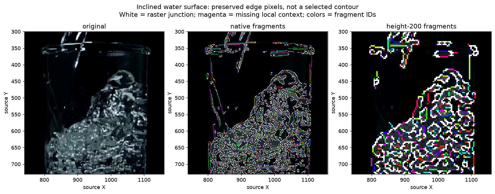

# Observed-edge fragment representation — 2026-10-09

Base: `3b73f269d015c5826c38325e2feffc23778f7eb7`. This completes the agreed
representation implementation and fixed-input checks. The
[Work Plan](../../00-project/work-plan.md) owns the next transition;
the [machine record](2026-10-09-observed-edge-fragments.json) preserves the
preflight, exact source/input hashes, scripts, results and failed-verifier repair.

**Result:** all **25/25** graphs preserve every observed edge pixel and neighbour
link: **178,209 vertices / 226,937 links / 130,607 fragments**. The representation
has no shared horizontal seed or total vertical-span restriction. This establishes
lossless raster geometry, not physical boundary recall, a complete joined contour
or a working Oil/Foam selector. Dense texture and diagonal raster links produce
many short fragments, including multiple fragments at one junction.

## Hypothesis and existing owner

The [preceding material-path audit](2026-10-09-public-path-representation.md)
found seed/global-band restrictions before temporal association. Instead of
widening that band or choosing a different top-k, preserve the existing edge
raster's local shape and all junction alternatives first.

The existing offline
[`s11_contour_contact_probe.py`](../../../tests/diagnostics/s11_contour_contact_probe.py)
already owns saved-edge topology and column clearance. Its new
`measure_edge_fragments` API retains the complete 8-neighbour graph and partitions
its links into maximal degree-two chains, junction-return paths, cycles and
isolates. It does not thin, rank, smooth, bridge gaps or pick a turn. Crop/mask
adjacency remains explicit missing context. The
[architecture contract](../../20-architecture/s11-foam-component-diagnostics-architecture.md#offline-observed-edge-fragments)
defines resource bounds and output semantics. Existing probe APIs and all
production callers are unchanged; no production owner imports the new API.

This differs from the rejected connectivity-as-identity proposal: no connected
part is called fluid, glass or a physical target. Every result remains
`physical_identity=UNRESOLVED`, `decision=NOT_EVALUATED`, `selected_front=null`.

## Frozen controls and coordinates

- Reuse all nine exposed sample5/6/7 frames, each at native and height-200 scale,
  with exactly the preceding audit's crops, resize and preprocessing settings.
  Load the saved crop arrays, recompute unchanged preprocessing, and verify glare
  equality against the saved arrays. Visibility is the rectangular crop minus
  that glare mask. No video decode, Foam execution or proposal generation occurs.
- Reuse seven saved sample4 captures: frames 420, 450, 480, 1620, 1635, 1665 and
  1680 (14/15/16/54/54.5/55.5/56 s). Read captured Canny/effective/glare pixels
  directly. Existing real-front, mixed/rim and internal-texture judgments retain
  their regional scope; frame 1635 remains unreviewed.
- All inputs are development exposures, not holdouts. Forty-nine input files,
  221 production Python files and four diagnostic/test files are hash-pinned and
  unchanged across the successful run. No new recipe, mask, label or threshold.
- Arrays store **working-raster** pixel centers with origin `(0,0)`. Source mapping
  is `source_origin + (working + 0.5) * source_per_pixel - 0.5`, with separate X/Y
  factors for resize rounding. The original source crop and scale are recorded
  per case; scaled indices are never passed off as native coordinates.

Preflight was saved before graph measurements. Output `001` retains the first
failed verifier; successful output `002` is a separate directory. No cases,
settings, implementation or image interpretations were changed after the failure.

## Results and image inspection

| Control | Native vertices / fragments | Height-200 vertices / fragments |
|---|---:|---:|
| Water empty | 15,807 / 11,010 | 1,352 / 1,181 |
| Water inclined | 40,941 / 39,136 | 3,653 / 3,947 |
| Water settled | 18,492 / 14,210 | 1,572 / 1,371 |
| Beer empty | 16,689 / 8,649 | 3,891 / 2,015 |
| Beer forming | 10,325 / 4,943 | 3,451 / 1,450 |
| Beer layered / top cropped | 16,252 / 13,875 | 2,739 / 1,243 |
| Milk empty | 11,584 / 6,792 | 1,963 / 1,103 |
| Milk pouring | 9,270 / 5,239 | 2,128 / 1,443 |
| Milk settled | 8,495 / 4,097 | 1,968 / 1,151 |

Seven native sample4 rasters contain 7,637 vertices and 7,752 fragments. A fragment
count can exceed a vertex count because junction vertices participate in multiple
link-disjoint fragments. These counts do not measure distinct physical objects.

The agent inspected all four sample sheets and the inclined-water detail. Colors
identify arbitrary fragment IDs, white marks degree-greater-than-two raster
junctions, and magenta marks crop/mask-adjacent context. The 37-color palette
repeats, so matching colors do not prove a shared fragment across space or frames.

Qualitatively, the inclined water's rising outline has local edge support across
its changing height, together with dense internal texture and glass edges. The
graph can retain that shape without one seed-centered band, but does not choose
or certify the full outline. Empty-glass images retain prominent rim/base edges.
Beer forming has visibly sparse native edge support compared with its reduced
raster; scaling/preprocessing availability still matters before graph formation.
Milk retains both liquid-adjacent and glass/stream edges; white appearance does not
establish Foam. Sample4 preserves curved rim, previously reviewed fluid regions
and internal-texture alternatives. No region-level human reply is promoted to an
exact fragment label. The previously confirmed water interpretation stays closed.

Long fragments also occur on glass: the empty-water native graph includes a
fragment with 376-pixel Y span. Length, smoothness, connectivity or large span
therefore supplies no target authority. Missing raw edges remain missing; this
representation cannot recover upstream evidence it never receives.

## Verification and repair

The focused suite passed **57 tests** across the new fragment tests and existing
contact/clearance tests. An independent coordinate-set oracle checks adjacency
and link partitioning on curved/vertical paths, branches, cycles, isolated points,
dense/narrow rasters and 50 fixed random graphs. Controls cover observed versus
masked gaps, crop censoring, hidden-pixel invariance, coordinate translation,
empty visibility, invalid input and pre-allocation resource bounds. Identical
geometry with different possible physical meanings remains unresolved.

All 25 real graphs reconstruct the original visible-edge raster exactly. Unique
links are valid pixel neighbours; independent signed-16-bit convolution and
shifted-array sums agree on every pixel's neighbour count. Fragment-link
multisets equal the original graph, each link occurs once, and internal vertices
have degree two. Separate checks reconstruct crop/mask flags and input hashes.
Every saved NPZ uses plain arrays, including offsets for ragged fragment lists.

The first verifier stopped on the first empty-water graph: OpenCV's uint8 output
path returned a neighbour-count sum of 17,271 instead of 39,582. Signed-16-bit and
float32 outputs matched all graph vertex degrees. The repaired verifier uses
signed-16-bit counts plus an independent NumPy shifted-neighbour sum; graph code
and inputs were unchanged. The initial script, preflight and failure values are
retained in the machine record. This was a verification dependency discrepancy,
not an image interpretation or detector repair; its library-internal cause was
not investigated here.

Graph construction took approximately 2–85 ms per frozen raster in this local
Python 3.14.4 / NumPy 2.5.1 / OpenCV 4.14.0 run. This excludes preprocessing,
verification, serialization and display; it is not target-Windows performance.

## Consequence and next bounded work

The diagnostic representation is implemented and verified. It is not ready for
production selection or temporal authority. The next design must state how
multiple fragments delimit consistently owned regions on both sides, preserve
competing branch/gap explanations, and abstain when that ownership is unavailable.
Define that observable and its opposing controls before a new image trial. A
longest/uppermost/smoothest connected chain or another isolated strip match would
repeat known failures.

Reuse the inclined and settled water, empty glass, cropped beer top, bulk-white
milk, sample4 real Foam, rim-jump and internal-texture controls. Test spatial
side ownership separately before using joint cross-frame correspondence. Keep
Oil/Foam independent, ML excluded and existing acceptance gates intact. No new
human pixel labeling or Windows action is required to close this representation
step; actual physical ambiguity may require a targeted later question.

## Detector Governance

- Logic-map nodes: `FRAME-EVIDENCE`, `OIL-PROPOSAL`, `OIL-CANDIDATE`, `FOAM-CANDIDATE`, `TRACE-PUBLICATION`
- Failure-registry entries: `S11-F02`, `S11-F03`, `S11-F04`, `S11-F06`, `S11-F07`, `S11-F09`, `S11-F10`
- First harmful stage: no observed-pixel/link loss in this offline representation on the fixed controls; upstream edge absence and physical contour selection remain unquantified without exact truth and an eligible decision rule.
- Logic-map impact: NONE — the existing offline topology probe gains an API with no production caller; candidate, temporal and publication owners remain unchanged.
- Failure-registry impact: UPDATED — F02 records exact observed-raster conservation and the unresolved fragmentation/physical-identity boundary; previous connectivity and rim-jump counterexamples remain applicable.
