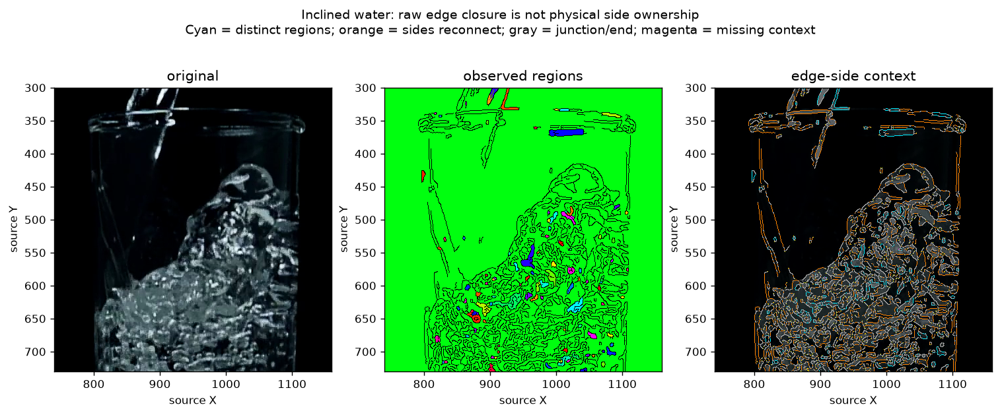

# Observed side-region prerequisite audit — 2026-10-09

Base: `5c28382ebe315008ce59e4497b1d0253a2d9d6a6`, clean main. The user authorized
the next staged investigation after the lossless edge-fragment implementation.
The [Work Plan](../../00-project/work-plan.md) retains current authority. The
[machine record](2026-10-09-observed-side-regions.json) contains the preflight,
complete readout, scripts, verification and input/output hashes.

**Disposition: do not adopt distinct raw-edge regions as a required physical
side-ownership gate.** On the fixed 25 rasters, 84,025 of 91,748 fully observed
degree-two locations with two nonempty side arcs reconnect through the same
non-edge component. The remaining 7,723 locations have different region IDs,
including empty-glass contexts. Neither outcome identifies material. The prior
fragment representation remains valid; this closes only the hard-region
prerequisite proposal, not every use of local sides or reference information.

## Question and earlier mechanisms

The [fragment implementation](2026-10-09-observed-edge-fragments.md) preserves all
observed geometry but leaves junctions and physical roles unresolved. Before
using connected regions as the objects on either side of a fragment, check
whether saved raw edges actually provide such a partition.

The [earlier connectivity counterexample](../../60-evidence/s11/2026-10-08-d2-region-connectivity-feasibility.md)
received ideal nominal regions. It already rules out connectivity as an identity
certificate. This audit measures availability of separation in **actual edge
rasters**, including leaks and masked context. It does not reopen that certificate.
Discovery also found raw-pixel region competition, ordered side texture, local
contact/clearance and two-side correspondence owners. None supplies physical
region ownership from the fragment graph. This read-only audit uses OpenCV's
existing component operation and saved graphs; it adds no production function,
permanent alternative probe API or new dependency.

## Frozen measurement

1. Reuse all 25 preceding graphs: nine public scenes at native/height-200 scale
   and seven sample4 contexts. Read exact visibility and fragment arrays. No
   regeneration, crop/scale/morphology change, fitting or video decode.
2. Label `visible AND NOT edge` pixels with four-neighbour connectivity, paired
   with eight-neighbour edges. Preserve region area and contacts with the crop
   boundary or an actually unavailable pixel. An edge is a geometric barrier,
   not missing visibility or an established physical segmentation.
3. At a fully observed degree-two vertex, its two edge neighbours split the
   eight-position surrounding ring into two arcs. Each nonempty arc is a connected
   non-edge set. Record both component IDs. Equal IDs mean an observed path
   reconnects the local sides; different IDs mean separation inside this raster
   only. No above/below material role is assigned.
4. Preserve junction/endpoints, missing context and empty arcs explicitly. A
   fragment has `CONSISTENT_PAIR` only if all its degree-two samples have distinct
   IDs with the same unordered pair. No side samples, reconnection, changing pairs,
   missing context and empty arcs remain separate reasons. This geometric predicate
   never accepts a physical contour.

Coordinates retain the preceding crop/resize mapping. Region IDs are frame-local;
no identity transfers between frames or scales. Region contact with missing
context cannot establish global closure. Even complete separation does not prove
a physical interface. Preflight fixed the rule and controls before measurements;
the stop rule forbids gap filling, merging, mask changes or favorable subsets.
All inputs remain development exposures, with no new truth assignment.

## Synthetic and real results

Eight constructed controls pass: full separator, one-pixel gap, diagonal
separator, closed pocket, masked separator, empty/dense rasters and identical
geometry with opposite required physical interpretations. Removing one recorded
pixel from the separator changes two observed components into one: all 20
remaining eligible side samples reconnect. Its physical interpretation need not
change when a raw edge pixel is missing. A hidden gap leaves two regions that
both touch unknown support; it cannot certify closure.

All 25 real graphs and all 178,209 original edge vertices are retained:

| Vertex context | Count |
|---|---:|
| Junction/endpoint, no degree-two side sampling | 81,569 |
| Crop/mask censors local ring | 1,196 |
| Two edge neighbours leave one side arc empty | 3,696 |
| Two side arcs reconnect to the same observed region | 84,025 |
| Two side arcs have distinct observed region IDs | 7,723 |

Thus 91.6% of **eligible geometric queries** reconnect. This denominator contains
all features, not reviewed physical boundaries; it is not a miss rate. Of 130,607
fragments, 2,359 have a consistent distinct pair and 113,488 have no degree-two
side samples. The latter are mostly short junction-to-junction pieces of the
complete eight-neighbour graph, not absent evidence. The receipt retains all
mixed failure reasons rather than dropping those pieces.

| Native scene | Side queries: reconnect / distinct | Largest free component's share of visible non-edge pixels |
|---|---:|---:|
| Water empty | 7,790 / 698 | 99.42% |
| Water inclined | 12,996 / 2,240 | 97.29% |
| Water settled | 7,858 / 1,244 | 98.79% |
| Beer forming | 6,577 / 251 | 99.97% |
| Milk settled | 5,798 / 61 | 99.96% |
| Sample4 f1680 | 311 / 8 | 99.55% |

These are full fixed-crop counts, not measurements within a human-labeled contour.
All other scenes/scales remain in the receipt. No favorable scale is adopted.
Of 7,723 distinct-region vertices, 7,657 have a pair containing a region with
crop/mask contact. That context alone cannot justify rejecting a real front.

The agent inspected all four native sample sheets and this detail. The region
display largely merges air-looking and fluid-looking parts through edge gaps;
small enclosed cells also occur within texture and glass. The side overlay shows
reconnection around both water-adjacent and glass features. This is qualitative
assistant inspection, not new human contour truth. Cyan denotes different region
IDs, orange reconnection, gray junction/endpoints, magenta missing context and
yellow an empty arc. Repeating palette colors in the middle panel are not unique
IDs; saved labels and measured sizes govern the geometric query.

## Verification

An independent row-run union oracle verifies every real component partition:
122,483 horizontal free runs covering 12,619,010 pixels, joined only by vertical
overlap, map bijectively to 1,151 OpenCV component IDs. A separate verifier floods
the ring's free cells without the runner's ring-index slicing and checks all
96,640 degree-two results. It independently reconstructs all 1,151 component
contact flags and checks the consistent-pair predicate over all original
fragments, including the 2,359 consistent results.

All 51 pinned inputs, 221 production Python files and the existing fragment probe
are unchanged. Saved arrays/figures, script identities and prior graph hashes
match their pins. No production code or permanent probe changed, so the passing
57-test fragment suite was not rerun. The eight new synthetic controls and
exhaustive artifact checks verify this read-only measurement.

## Consequence and next design boundary

Do not require raw edges to enclose separate material regions, label reconnection
non-interface, or manufacture closure with dilation. Keep the lossless fragments,
gaps and branches. This does not invalidate the user's water/Foam/Oil judgments
or show that side information in the original pixels is unusable.

Next design a bounded comparison using an **existing reference scene and multiple
related contour parts together**: preservation, occlusion and optical deformation
of reference features are competing explanations. Public empty-glass frames are
available for this local route, but are not per-pixel material truth. Existing
reviewed structural references retain their narrower scope and remain optional;
no new recipe preparation or reference requirement is imposed.

Before a trial, specify one joint reference-to-current mapping for the related
parts and an explicit optical-deformation alternative. Independent best patch
matches, coordinate overlap or surviving structure exclusion cannot become fluid
authority. Protect an actual fluid boundary crossing a structure; abstain when
occlusion and optics are indistinguishable. This is a design entry condition,
not a tested model. Retain the rim-jump, real-front, internal-texture, cropped-top
and bulk-white controls. Do not rerun closed standalone connectivity/strip rules.

No new user interpretation or Windows execution is needed for this checkpoint.
Physical selection, O2 acceptance and target-field qualification remain separate.

## Detector Governance

- Logic-map nodes: `FRAME-EVIDENCE`, `OIL-PROPOSAL`, `OIL-CANDIDATE`, `FOAM-CANDIDATE`, `TRACE-PUBLICATION`
- Failure-registry entries: `S11-F02`, `S11-F03`, `S11-F04`, `S11-F06`, `S11-F07`, `S11-F09`, `S11-F10`
- First harmful stage: requiring raw-edge component separation loses the constructed gapped separator and is broadly unavailable on actual rasters; exact physical recall and production first loss remain unmeasured.
- Logic-map impact: NONE — saved-graph measurement only; production sources, fragment implementation, authority, temporal and publication owners are unchanged.
- Failure-registry impact: UPDATED — F02 records the raw-edge side-partition limitation without promoting connectivity, enclosure or region count to physical identity.
