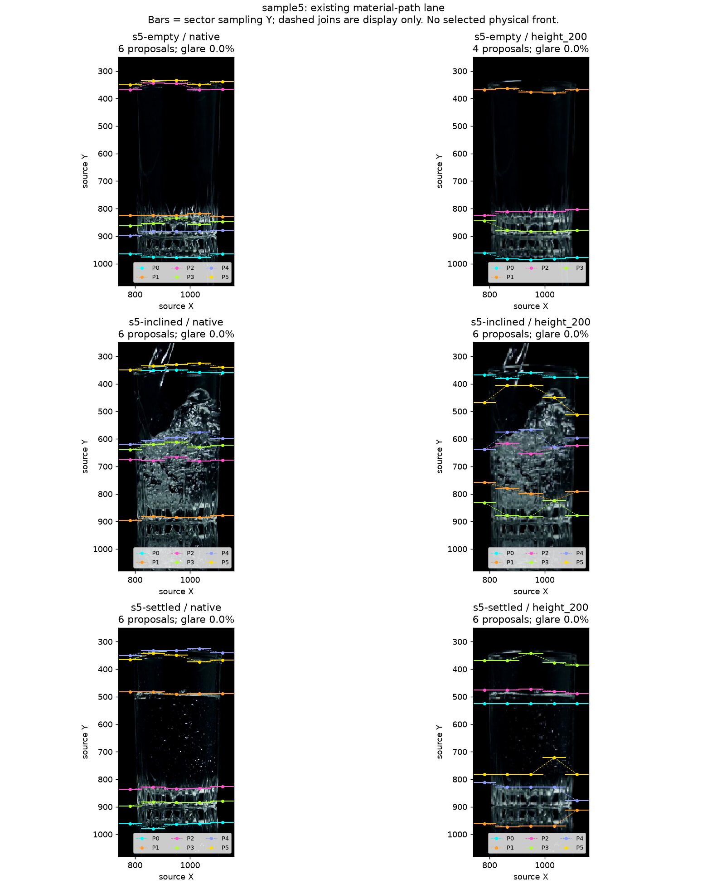

# Public-video native path representation audit — 2026-10-09

Base: `ca71439bdae1d662b9b9ffac655f97d9ff4b74ba`.
The [inclined-water reply](2026-10-09-public-water-surface-reply.json) closes the
physical question at qualitative scope. Before implementing a new temporal
correspondence mechanism, this audit checks whether the existing spatial path
owner represents that changing boundary at all. The [Work Plan](../../00-project/work-plan.md)
retains current gate authority; the [machine record](2026-10-09-public-path-representation.json)
contains the fixed inputs, scripts, all results and verification.

**Result:** a confirmed code-level representation restriction precedes temporal
association. Every path stays in one global seed-centered vertical band, and
seed generation first requires same-row evidence in at least three sectors.
An ideal inclined five-sector profile can therefore lose its seed even though
every adjacent step fits the existing jump bound. This is a bounded finding
about one proposal lane, not a new classifier or a diagnosis of the complete
application's field behavior.

## Existing owner and fixed execution

Responsibility discovery found the current
[`oil_material_path.py`](../../../src/oil_tracker/adapters/vision/oil_material_path.py)
owner and its first call from `assemble_phase_candidates`. It already connects
five spatial sector profiles and captures exact per-sector sampling geometry.
The earlier `s11_spatial_path_probe` is a historical candidate-centered probe,
not the current owner. Neither a replacement matcher nor a second path generator
was introduced. The earlier independent-strip mechanism was not rerun.

The [nine source cases](2026-10-09-public-scene-controls.md) use their previously
fixed display crops. For each, run native pixels and one aspect-preserving copy
at height 200, width rounded proportionally, using `cv2.INTER_AREA`. This is a
fixed small-raster comparison, not a reconstruction of sight-glass optics or a
scale selected for favorable results. Actual X/Y scale and pixel-center mapping
are recorded separately; integer width rounding is not hidden.

The exact isolated call is current `preprocess` →
`detect_bottom_connected_foam` for its raw combined material-evidence map →
`generate_material_path_candidates`. Use unchanged `DetectorSettings()` and
the assembler's bounded top-k of six. Static artifact map and local exclusion
are absent. The full frozen crop is the effective rectangle; existing glare
processing remains active. There is no calibrated Glass ellipse or new Recipe.

This reproduces the **first material-path lane's arguments**, not the full
assembler, configured application baseline, alternate Oil candidate families,
Foam episode resolver or final Oil/Foam selection. Raw material evidence is not
accepted Foam authority. All scene exposure stays in development. Videos were
not decoded again; source frame PNGs were reused.

## Seed and geometry restrictions

The unchanged code has separate restrictions:

1. `_seed_rows` zeros the pooled score at rows where fewer than three sector
   profiles have positive score. An inclined boundary can have strong evidence
   at different rows in different sectors without supplying such a seed.
2. `_polarity_path_for_seed` searches only `seed ± maximum_jump` in **every**
   sector, as well as restricting each adjacent step. Thus the entire represented
   Y span is at most twice the jump bound. This is stronger than local continuity.
3. Later polarity/support/strength checks, median-based deduplication and top-k
   retention remain separate. More candidates cannot remove the global band.

For these native crops the jump bound is 24 pixels, giving a 48-pixel total
span. At height 200 it is 15 working pixels, giving a 30-pixel total span. The
same working-pixel span corresponds to different source heights after resize.

The predeclared ideal-profile control uses five strong single-row peaks:

| Input profile rows | Adjacent step / total span | Original seeds | Largest path across every possible seed |
|---|---|---|---|
| `[80,80,80,80,80]` | 0 / 0 | `[80]` | Five sectors |
| `[120,100,80,60,40]` | 20 / 80, with jump bound 24 | None | Three sectors |

The second control passes the local step size by construction but cannot fit
the shared seed band. Enumerating all possible seeds isolates that restriction
even under an optimistic external seed. These are exact synthetic profile
observations, not physical image labels or a proposal to widen a threshold.

## Real-image readout

All 18 rasters are retained. The final lane output contains **100 proposals**;
each is a candidate only. The saved-profile follow-up visits every original
seed before deduplication/top-k, without changing crops or thresholds.

| Scene | Native: eligible seed paths → retained | Height 200: eligible seed paths → retained |
|---|---:|---:|
| Water empty | 15 → 6 | 7 → 4 |
| Water inclined | 52 → 6 | 18 → 6 |
| Water settled | 20 → 6 | 12 → 6 |
| Beer empty | 21 → 6 | 7 → 5 |
| Beer forming | 9 → 6 | 7 → 4 |
| Beer layered / top cropped | 10 → 6 | 4 → 3 |
| Milk empty | 17 → 6 | 9 → 6 |
| Milk pouring | 21 → 6 | 8 → 6 |
| Milk settled | 19 → 6 | 8 → 6 |

Eligible seed paths are not distinct physical boundaries; several can overlap.
All pre-retention paths obey the same total-span bound. The inclined-water run
has 53 native seeds, one of which returns no eligible path; its 52 remaining
paths are recorded. This cannot identify which lost seed was a true boundary.

The agent's overlay inspection finds no retained path following the **complete**
reviewed inclined water surface. Native paths occupy the rim, body and base;
the reduced P5 mixes rim/stream-side context with water-adjacent context. The
settled native P1 lies near the visible surface while other paths follow glass
features. These are qualitative observations, not measured contour recall,
false-positive rates or human approval of any plotted path. Horizontal bars are
the real sector sampling Y; dashed connectors are display aids, not traced edges.

Beer and milk also generate paths in their empty-looking images. This is expected
candidate-level ambiguity; it does not prove false public output. Beer retains
its cropped-top limitation, and the milk body remains distinct from any unproven
Foam segmentation. Their local sheets and hashes are preserved in the receipt.

## Verification and consequence

The existing generation calls with diagnostic capture ON and OFF produce equal
complete candidate records on all **18/18** rasters. An independent saved-array
check reconstructs the seed rule and verifies all **100 paths / 473 sector samples**:
ordered sectors, source profile values/channel/scale, median Y, local jump and
global band. Every retained path occurs in the exhaustive original-seed audit.
All 18 input pins, 221 production source pins and recorded figures are unchanged.

The first verifier compared JSON lists against the owner's tuple fields. Correcting
that serialization comparison made full path equality pass; original verifier
and preflight are retained. No measured result or production code was repaired.
No new implementation tests or production acceptance suite were needed for this
read-only experiment; its assertions directly check the captured artifacts.

This changes the immediate research order: establish a representation that can
retain the local shape of a curved boundary and its competing alternatives
**before** treating a short sector path as the object for temporal association.
Keep profile availability, seed filtering, global-band restriction and capacity
loss separate. Enlarging a window/top-k, lowering contrast thresholds or accepting
every connected path is not an established repair. Independent side ownership,
fixed-pattern opposition and the previous rim-jump counterexample still apply.

The next design needs local boundary support without a shared horizontal seed
assumption, with explicit missing support and no immediate scalar promotion.
Its single-frame representation and subsequent temporal correspondence must have
separate controls. This audit does not yet provide that implementation, establish
physical side identity, or waive existing O2/Windows acceptance. The human water
question remains closed; no new physical interpretation or Windows task is needed
to understand this geometry restriction.

## Detector Governance

- Logic-map nodes: `FRAME-EVIDENCE`, `OIL-PROPOSAL`, `OIL-CANDIDATE`, `FOAM-CANDIDATE`, `TRACE-PUBLICATION`
- Failure-registry entries: `S11-F02`, `S11-F03`, `S11-F06`, `S11-F07`, `S11-F09`, `S11-F10`
- First harmful stage: synthetic ideal inclined profiles lose the seed before path formation; even supplied seeds cannot span all five sectors under the global band. Real full-pipeline first loss remains unknown without contour truth and other-lane/selection execution.
- Logic-map impact: NONE — isolated calls reuse current owners; no implementation, proposal authority or publication route changes.
- Failure-registry impact: UPDATED — F02 records this bounded seed/global-band representation limit and distinguishes it from capacity and physical-identity failures.
