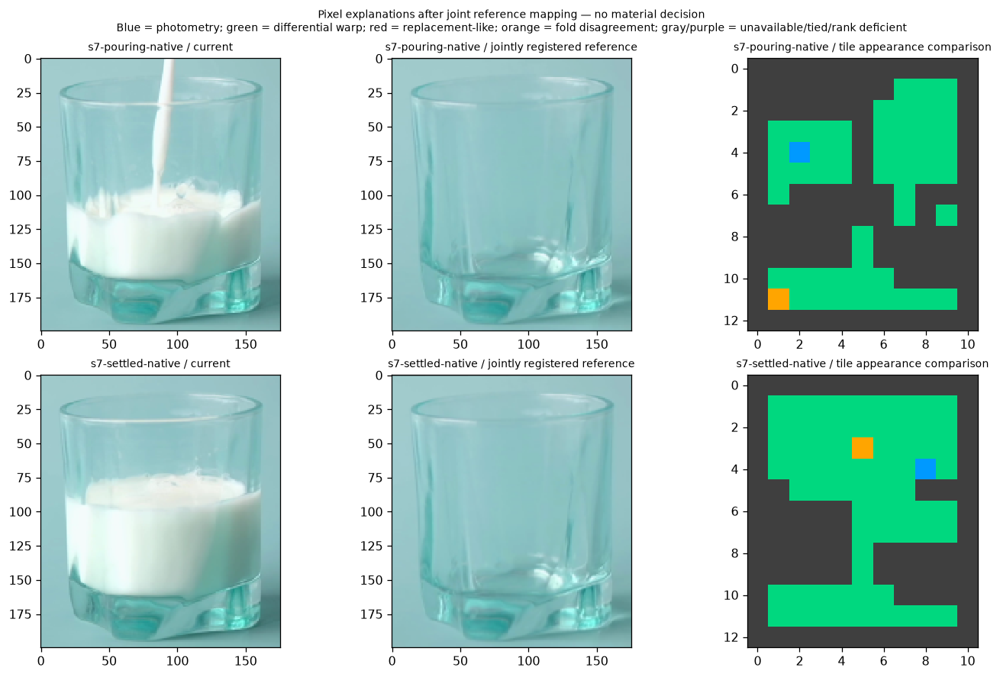
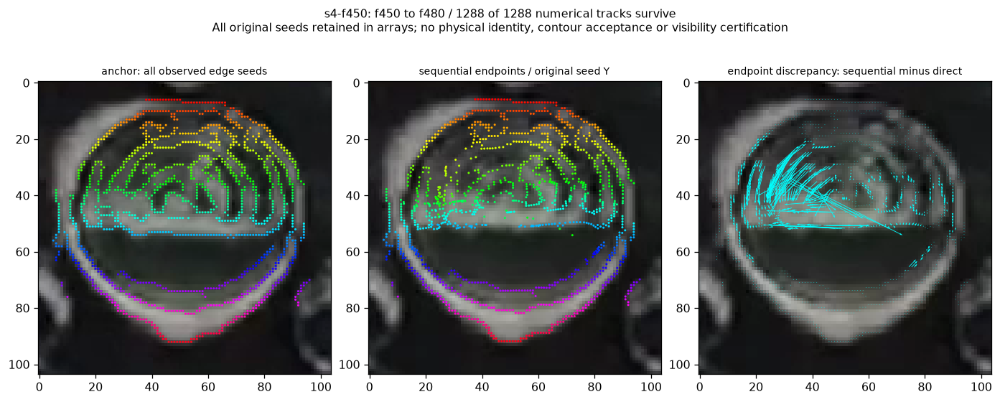
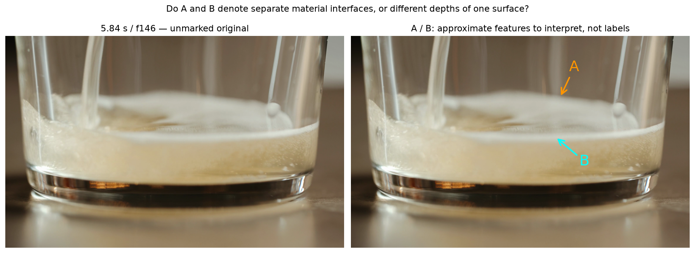

# Reference correspondence and consecutive-frame investigation — 2026-10-09

Base: `9f8dfe767e723482e395ee6b86dd798b5c4db734`.
The [Work Plan](../../00-project/work-plan.md) owns current action and acceptance.
The [machine record](2026-10-09-reference-correspondence.json) preserves every
preflight, runner, result, verification and the failed synthetic expectation.
Large arrays and complete figures remain hash-pinned under `sample/output/`.

**Outcome:** multiple reference features expose the previous large rim-match
jump, and consecutive frames avoid that jump in the measured control. Neither
operation establishes material identity. The tested registered-pixel model is
not an occlusion discriminator. No detector behavior or physical selector is
promoted. A new public beer-scene question separates perspective geometry from
independent Foam–air / Foam–liquid roles before the next physical-control rule.

## Prior failure and distinct operations

The [raw side-region audit](2026-10-09-observed-side-regions.md) ruled out requiring
raw edges to close separate regions. The [two-side strip comparison](2026-10-09-foam-two-side-transport.md)
let a confirmed-rim query jump to unrelated features even when both folds agreed.
This investigation does not rerun either rule with different cutoffs.

1. Fit multiple reference features together, preserving one common spatial map;
   keep translation, affine and projective alternatives and held-out errors.
2. After that map, compare registered pixel explanations for photometry, local
   optical deformation and replacement. Freeze models before measurements.
3. Add previously unused **intervening source frames** to compare consecutive
   local appearance tracking against a direct endpoint match. Preserve original
   graph relationships and every starting vertex, without a horizontal seed band.

Discovery found the existing phase-translation and exposure-fit owner in
`temporal_raster_evidence`, and the offline ordered-patch/registered-residual
probe. No SIFT, Lucas–Kanade or shared affine/projective correspondence owner
exists in the searched production, diagnostics or scripts. Temporary offline
runners use installed OpenCV primitives for this feasibility question. They add
no duplicate production service, permanent alternate API or new dependency.
SIFT and Lucas–Kanade are conventional image processing; no learned model is used.

## Joint reference layout

The frozen scope is 24 pairs: all nine public scenes at native and height-200
resolution, each compared with its own empty-looking scene, plus six sample4
pairs including a self-control. All are development exposures. A reference
image is neither per-pixel structure truth nor a required new recipe input.

Use SIFT with 512 features, three octave layers, contrast .04, edge threshold 10
and sigma 1.6. Reciprocal L2 matches must pass the strict .75 ratio in both
directions; duplicate exact source/destination locations are removed before
splitting folds. Fit translation by median and affine/projective maps by RANSAC
with a fixed 3-working-pixel radius, 2,000 iterations, .99 confidence and fixed
seed. Alternating source-location folds retain **every** held-out residual,
including outliers. These correlated spatial folds are not independent efficacy
trials. Raw descriptor footprints may span glare, material and crop context.

This operation aligns common scene appearance; it is not yet a jointly deformable
model of multiple parts of one physical contour. That design obligation remains.

The 24 real pairs retain **1,576 unique-location matches**. Many mappings explain
common glass-rim/base arrangement, but individual false matches remain. Native
milk pouring has only 13 matches; a projective fold's held-out median error is
about 273 pixels despite a much smaller all-data error. Reduced beer forming has
five matches and its later layer only three. Sparse/degenerate folds remain
unavailable; choosing the lowest fitted error would hide these failures.

The previously wrong sample4 15→16 s rim seed is working XY `(18,63)`, source
`(561,861)`. Across all three maps and both folds, the predicted common-layout
position remains near `(18,63)`. The old independent-strip destinations
`(72,31)` / `(58,30)` disagree by **62.60–62.78 / 51.64–51.86 pixels**.
This is geometric opposition to the old jump, not certification of a particular
current rim pixel or a fitted displacement gate.

Synthetic identity, known translation, known affine transformation and blank
controls pass their explicit assertions. Opaque replacement, smooth optical
warping and repeated-pattern controls retain their observations without claiming
physical success. Both occlusion and warp can reduce matches; repetition still
produces matches. Nonmatch is not an occlusion or fluid certificate.

## Registered-pixel opposition and preserved failed expectation

Use the already-saved native affine maps (all matches and both fold fits),
converted by exact resize-center coordinates to height-200 public rasters;
sample4 stays native. Fixed 16×16 tiles require full saved visible/nonglare context
and interpolable reference donors, including gradient neighbours. No tile is
shrunk around missing support. Forty-five pair/map views remain in the record.

Three least-squares image models predict opposite checkerboard pixels:

| Model | Parameters | Meaning and limitation |
|---|---:|---|
| Channel gain/offset | 6 | Local photometry; gains are unconstrained |
| Photometry plus shared X/Y gradient terms | 8 | First-order optical-deformation alternative, not a physical flow field |
| Constant current BGR | 3 | Replacement-like appearance, not proof of opacity or fluid |

Every model must be full rank in both folds. A strict lowest held-out error must
agree between folds; exact ties and disagreements remain explicit. No physical
error threshold, complexity preference or outcome-driven retuning is added.

**Run 001 stopped before any real measurements.** The synthetic expectation
that constant replacement would uniquely favor the third model was wrong:
zero gains and constant offsets reproduce it in the other models too. The
original script, preflight and failure are preserved. Run 002 changes this
expectation to a tie and completes the promised masked/partial-tile control;
it changes no model or real-data parameter. All five implementation controls
then pass. This is a repaired test expectation and an exposed identifiability
limit, not a repaired occlusion detector.

| Outcome over all 5,328 tile/view queries | Count |
|---|---:|
| Unavailable context | 2,744 |
| Rank-deficient reference | 47 |
| Fold disagreement | 110 |
| Tied models | 906 |
| Photometry preferred | 58 |
| Differential-warp model preferred | 1,458 |
| Replacement-like model preferred | 5 |

The richer warp model wins across much of both glass and fluid-looking context.
The five replacement preferences are held-out finite-sample preferences; they do
not undo the exact model nesting. Image inspection finds no established material
separation. The model comparison is **CLOSED WITHOUT PROMOTION as an occlusion /
material decision rule**. Do not constrain gains or tune tiles after this result
to manufacture a positive, and do not count unavailable tiles as suppression.

## Consecutive-frame appearance tracking

A second preflight adds temporal resolution, rather than another endpoint-score
rule. Sequentially decode the four local videos, retaining 368 distinct source
frames in declared intervals. Public scenes use both existing scales; settled
water/milk are traced backward from their last frame. Five sample4 intervals
reuse the existing 14/15/16 and 54/54.5/55.5/56 s contexts. Every decoded anchor
matches its saved original pixels exactly.

All **176,130 original edge vertices and 224,107 graph links** in the 23 starting
rasters are retained. Pyramidal Lucas–Kanade uses a fixed 21×21 window, maximum
level 3, 30 iterations, .01 convergence tolerance and minimum eigenvalue .0001.
A point stops at its first failed OpenCV status or nonfinite/out-of-crop result;
there is no reinitialization, bridge or coordinate repair. Per-step reverse
matching errors and direct endpoint predictions are recorded without an error
cutoff. A backward result outside the image can have a large finite error; it
is not accepted physical support.

This is **local point tracking**, not a jointly constrained physical contour
optimizer. Original links expose geometric deformation, but do not enforce an
object. Full pyramid support may cross masks/materials or use border extension;
status and an in-bounds center do not certify visible support. Report survival
only as numerical availability, never as tracking accuracy or boundary recall.

| Numerical observation | Result |
|---|---:|
| Tracks retaining an endpoint | 167,976 / 176,130 |
| Original links with both endpoints retained | 213,592 / 224,107 |
| Saved finite positions across time | 4,801,542 |
| Finite per-step reverse errors | 4,621,473 |
| Water inclined, native: sequential/direct endpoint median disagreement | 22.97 px |
| Water inclined, height 200: corresponding disagreement | 5.28 working px |

The old rim seed now ends at `(17.42,61.64)` through consecutive frames; direct
Lucas–Kanade ends at `(18.02,62.65)`. Both avoid the old 52–63 pixel jump. The
maximum per-step reverse error for that seed is still 1.08 pixels. These are
unthresholded observations, not exact human correspondence truth.

Identity, known incremental translation and blank/aperture controls pass.
Crucially, a constructed **fixed-pattern optical warp** keeps all 77 tracks,
with median 4.29-pixel displacement and only .00115-pixel per-step reverse error.
Thus longevity and reverse consistency also cannot establish moving material.
The agent inspected native/public and sample4 overlays: short baselines reduce
some large jumps while appearance branches still diverge within the water/foam
context. No true-boundary success rate or new physical label is claimed.

## New physical interpretation checkpoint

The beer forming scene was previously only a provisional control with a diffuse
lower transition. Inspection of f146, f158 and f171 finds a rear-looking upper
white outline and a lower bright front arc. Before using these as two independently
owned material fronts, distinguish perspective depth from layer identity.

The assistant leans toward **rear/front views of the same thin foam layer**.
That does not certify the exact edge of either band, a Foam–liquid boundary,
Foam thickness or scalar Y. The user question asks only for this regional
physical interpretation; the pointers are display aids, not masks/contour truth.

[The three original temporal views](2026-10-09-beer-boundary-context.png) accompany
the question. At recording, the answer is pending. Do not assign A=Foam–air and
B=Foam–liquid from vertical order alone. If they are the same layer at different
depths, preserve both as projected alternatives without counting two physical
interfaces. If distinct interfaces are supported, preserve the distinct roles
without expanding the reply to exact coordinates. An uncertain answer keeps
this control unresolved; it does not trigger finer pixel labeling.

This question gates the next **material-side/control interpretation**, not the
arithmetic verification above. It is not a request to approve an algorithm or
repeat the closed water/sample4 judgments. No Windows action or file export is
needed. After the reply, specify one bounded contour-group/side-role mechanism
that retains optical opposition and real structure crossings before another
physical selection trial. The current results alone do not establish that rule.

## Verification and preservation

- Independently reconstructed **12,911** all/held-out layout residuals, location
  deduplication and fold disjointness. Preserved every outlier and missing map.
- Independently arranged channel design and SVD verified **15,328** full-rank
  held-out pixel losses, all tile statuses and context availability.
- Reconstructed all 23 track summaries, all first-failure indices, terminal
  no-resurrection behavior, source-index continuity and original graph identity.
- Verified runner/preflight/output hashes and every input/production-source pin.
  All **221 production Python files**, recipes, truth labels and earlier evidence
  remain unchanged. New public-video exposure is development only.
- No permanent diagnostic API or runtime changed. The already-passing fragment
  unit suite was not rerun; these new measurements use their own controls and
  artifact checks. O2/Windows efficacy was not evaluated.

## Detector Governance

- Logic-map nodes: `FRAME-EVIDENCE`, `OIL-PROPOSAL`, `OIL-CANDIDATE`, `FOAM-CANDIDATE`, `TRACE-PUBLICATION`
- Failure-registry entries: `S11-F02`, `S11-F03`, `S11-F04`, `S11-F06`, `S11-F07`, `S11-F09`, `S11-F10`
- First harmful stage: independent long-baseline correspondence can jump features; a shared map exposes the known example. New registered-pixel models are observationally nested and short-frame optical tracking also follows a fixed-pattern warp. These measured ambiguities occur before physical side ownership; the first complete production physical error remains unknown.
- Logic-map impact: NONE — offline feasibility runners neither change production owners nor introduce a selected front or publication route.
- Failure-registry impact: UPDATED — F07 records common-map opposition, pixel-model nesting and consecutive-frame optical ambiguity without declaring every future use of these measurements invalid.
