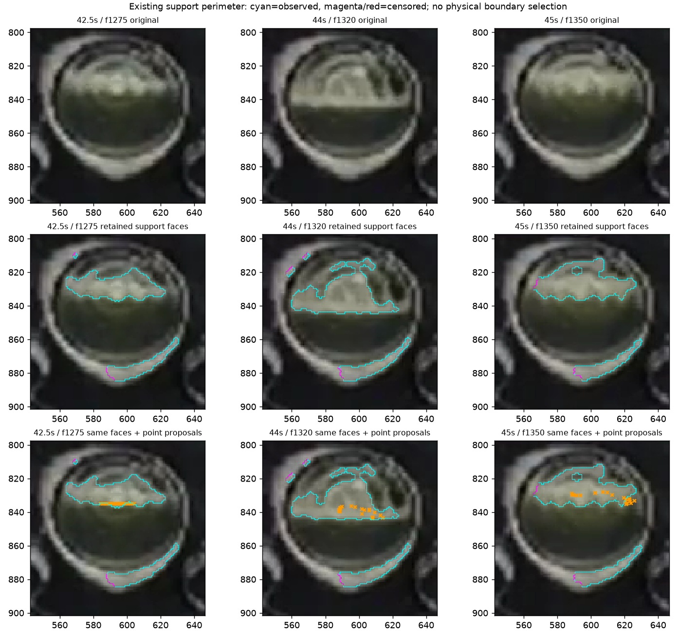
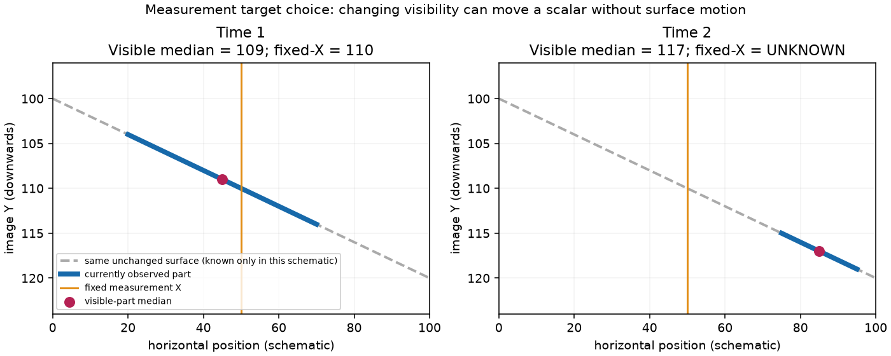

# Partial reference continuation and current-boundary prerequisite — 2026-10-09

Base: `d1cdab4ff438e8678bd7772ae5db0d7d90c6b3b5`. The
[Work Plan](../../00-project/work-plan.md) owns the next decision. The
[machine record](2026-10-09-reference-current-boundary.json) preserves the new
reply binding, frozen preflight, exact scripts, inputs, all output identities,
readouts and the separate synthetic measurement-target illustration.

## Received reply and scope

The user says **“foam-oil 경계에 남아있는걸로 보임”** about the rightmost orange
cluster in the 45 s panel. The [bound reply](2026-10-09-material-reference-late-oil-reply.json)
closes that question with its qualitative certainty. The observed outcome is
partial regional correspondence alongside separately attributed agent-observed
left/central drift. It is not complete target loss, exact point-ID truth,
whole-width success or a manual whitelist for inference. The old 42.5–44 s
chain and all prior material judgments stay closed.

## Frozen current-frame measurement

The next prerequisite is whether current image support supplies an observed
boundary around the reference hypotheses. The previous nearest-edge lookup had
no region-side membership. This readout therefore reuses the existing
`detect_bottom_connected_foam` diagnostic capture and
`s11_foam_support_geometry.measure_boundary_faces`, without changing either.
It is a test of available representation, not a new physical selector.

Use the same complete frozen plans: Foam f420–510, Oil f1275–1350, Structure
f450–480. There are **198 plan/frame rows and 167 unique native rasters**.
The existing recipe, original 104×104 images at source origin `[543,798]`,
effective mask and preprocessing remain fixed. Each raster invokes the isolated
Foam owner with capture ON/OFF; every non-diagnostic field is compared. This
does not run the Oil pipeline, phase/episode/sequence resolver or application.

Every retained label's oriented perimeter is preserved, including mask/crop
censoring. All live hypotheses get point membership and distances to all fully
visible faces; exact nearest ties remain in the saved arrays. No point is
snapped, no component wins, no lower/upper side is substituted and no distance
threshold is fit. Visibility remains effective AND NOT glare. Label zero means
outside retained appearance support, not physical Oil, air or absence of Foam.

**Verification:** capture ON/OFF matches on **167/167** rasters; all captures are
untruncated and label counts match diagnostic metadata. An independent direct
pixel/neighbor enumeration agrees with all **73,444** oriented faces. All input
pins and **221 production Python files** remain unchanged. No new source/helper
code was added, so unchanged unit suites were not repeated.

## Results and limits

| Plan / frame | Points inside retained support / outside / unavailable | Nearest fully visible face distance, min / median / max |
|---|---:|---:|
| Foam initialization f420 | 8 / 14 / 0 | 0.500 / 0.604 / 2.915 px |
| Foam f480 | 12 / 10 / 0 | 0.074 / 1.695 / 4.696 px |
| Oil initialization f1275 | 11 / 10 / 0 | 0.500 / 0.500 / 1.581 px |
| Oil f1320 | 21 / 0 / 0 | 0.137 / 4.463 / 7.104 px |
| Oil f1350 | 11 / 10 / 0 | 0.117 / 3.366 / 6.111 px |
| Confirmed rim f450 | 0 / 1 / 0 | 0.500 / 0.500 / 0.500 px |

The agent inspected original/perimeter/point sheets for all three plans. The
Oil-region lower perimeter retains plausible observed boundary geometry in the
displayed 42.5/44/45 s views while left/central tracked points may lie in its
interior. The new user reply supports the rightmost 45 s vicinity only; it does
not certify every cyan face or its localization. No per-pixel accuracy follows.

The same capture also outlines the glass rim. Early Foam support includes
internal/glass appearance and misses portions of the existing approximate upper
boundary. Thus a complete component or its nearest/upper/lower perimeter is not
an independently owned material boundary. Initial positive hints can be both
inside and outside support; even a confirmed rim can be exactly as close to a
face. A point-membership bit or proximity cutoff cannot be adopted from this
table. The representation may provide proposals, but physical role and branch
selection remain unresolved. No morphology, mask union or threshold rescue is
performed, and Oil is not made dependent on accepted Foam.

## Concrete measurement-target choice

Partial correct correspondence also exposes a separate product question:
**which spatial part of a curved/sloping real boundary should define one height
in the report?** This is not resolved by identifying the material boundary.

Source review finds no accepted replacement contour-to-scalar policy in the
[W1 target contract](../../20-architecture/s11-interface-observability-witness-architecture.md#w1-target-and-aggregation-contract--design-boundary)
or its [validation owner](../../30-validation/s11-interface-observability-witness-validation.md#w1-aggregation-challenger-controls--not-yet-acceptance-evidence).
Current `oil_material_path` uses the median of its generated native path as that
candidate's original Y; W3 preserves original candidate Y and does not transfer
new point averages into it. The present investigation changes neither contract.

The following **synthetic illustration**, not a measured video result, makes the
choice concrete. A stationary boundary is `y=100+0.2*x`, x=0…100. Observed X changes
from 20…70 to 75…95. Every shown segment is the same actual interface, yet the
visible-part median moves **109→117**. A fixed measurement at X50 observes 110
first and becomes UNKNOWN next. No actual boundary motion occurred.

| Proposed target for the next offline design | Meaning | Tradeoff |
|---|---|---|
| **A — fixed Glass-center location (recommended)** | Height of the independently observed current boundary at one fixed location; missing/ambiguous observation there stays UNKNOWN | Comparable location over time, but side-only correspondence cannot provide that height |
| **B — representative height of the currently visible real boundary** | A statistic such as a median over independently identified observed boundary samples | Can use partial visibility; changing observed extent can change the number without surface motion |

A reuses the existing Glass ellipse center as its conceptual location; sample4's
current recipe has center X595. The user is not asked to enter exact coordinates.
No interpolation, remembered Y or estimate from a distant fragment is included
in A. The exact candidate geometry, eligibility and any calibrated support
requirements remain a later fixed design/validation task. B also needs an
explicit sampling/coverage policy; this illustration does not implement one.

**User choice is pending** for the next design's measurement target, independently
for available Oil/Foam observations. This is not a proposal to make one series
depend on the other, require new setup, change the existing report immediately
or declare the current perimeter a physical detector. The former right-hand
image judgment is complete and will not be repeated.

## Disposition

The current-perimeter prerequisite is complete and retained. It provides source
geometry and exposes mixed support; it does not establish a reobservation rule.
Keep the previous fixed-pattern rejection and LK limits. Await the product
measurement-target choice before specifying which partial observations a new
scalar challenger should seek and evaluate. No new Windows work or exports.
Local XY stays OFF; optional-reference integration remains conditional; O2 OPEN
and FIELD FAIL are unchanged.

## Detector Governance

- Logic-map nodes: `FRAME-EVIDENCE`, `OIL-PROPOSAL`, `FOAM-CANDIDATE`, `FOAM-IDENTITY`, `PUBLICATION-PROVENANCE`, `TRACE-PUBLICATION`
- Failure-registry entries: `S11-F02`, `S11-F04`, `S11-F06`, `S11-F07`, `S11-F09`, `S11-F10`
- First harmful stage: current retained appearance support can omit or mix material boundaries before reference association; the new reply confirms partial regional correspondence, without locating the first exact tracking error. A moving support subset can also change an aggregate without motion in the constructed scalar control; this is not attributed as a measured runtime defect.
- Logic-map impact: NONE — unchanged isolated capture and existing geometry probes are reused; a product measurement-target choice is prepared without changing runtime decision or scalar owners.
- Failure-registry impact: UPDATED — F04/F07 preserve partial correspondence and current-perimeter limitations, separating them from complete loss and physical front authority; existing F09 scalar provenance remains intact.
