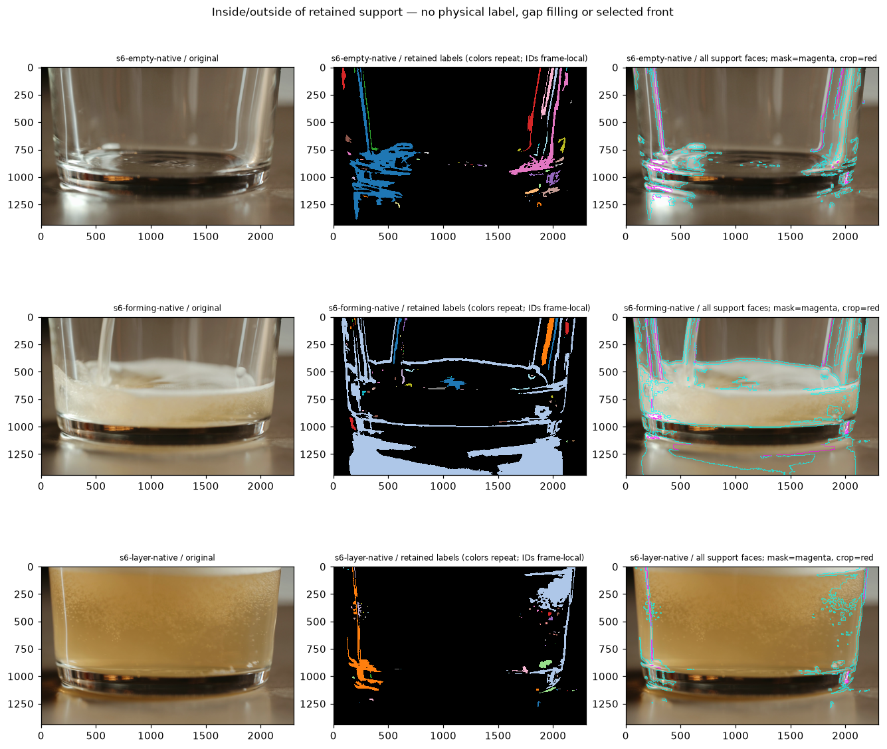
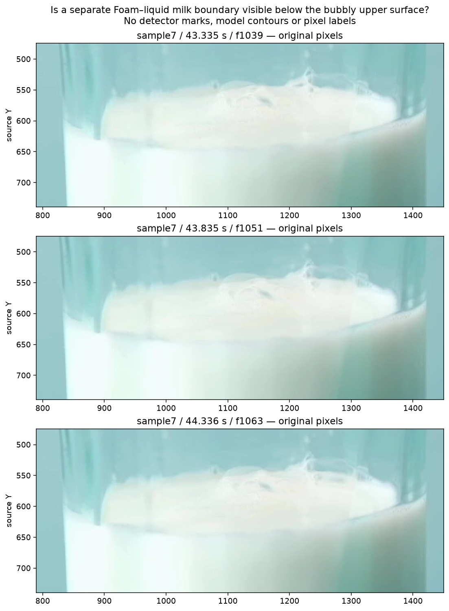

# Retained-support boundary membership — 2026-10-09

Base: `7bc44db254bf234e60cc0e8326aaa0eea7ec2948`.
Current action is owned by the [Work Plan](../../00-project/work-plan.md).
The [machine record](2026-10-09-retained-support-boundaries.json) preserves input
pins, frozen measurement, implementation/test source, scripts, all results and
independent verification. Arrays and full-size figures remain pinned locally.

## Received physical interpretation and resulting constraint

The user answered **“같은 얇은 거품층의 뒤쪽과 앞쪽임”** for sample6 A/B.
The [bound reply](2026-10-09-public-beer-layer-reply.json) closes this review.
Both projected arcs must be preserved without turning their vertical separation
into two independently identified material interfaces or physical thickness.
The reply supplies no exact contour, scalar, hidden lower-interface coordinate
or temporal correspondence truth. Existing water/sample4 judgments stay closed.

This motivates preserving a region and all its perimeter parts together. It does
**not** authorize equating a connected appearance component with physical Foam.
The preceding [joint layout and short-frame investigation](2026-10-09-reference-correspondence.md)
also showed that tracking cannot supply that missing identity.

## Implementation and reuse boundary

The existing offline owner
[`s11_foam_support_geometry.py`](../../../tests/diagnostics/s11_foam_support_geometry.py)
measures retained labels and their column relationships. Its new
`measure_boundary_faces` operation adds full two-dimensional inside/outside
membership without changing the column API or production code. Search found no
existing full support-perimeter owner. The raw-edge fragment graph is a different
input: image edges with no component-side membership. It remains unchanged.

The [architecture contract](../../20-architecture/s11-foam-component-diagnostics-architecture.md#offline-retained-support-boundary-faces)
keeps every oriented unit face between a visible nonzero label and a different,
masked or cropped neighbor. Same-label internal faces cancel. Each face retains
its owner label, neighbor label when visible, normal, owner/neighbor pixels and
exact half-pixel endpoints using doubled integer coordinates. IDs group all
parts, including holes and disconnected/diagonal pieces; no ring connection,
component merge, ellipse fit, gap fill or selected front is invented.

Visible label zero means outside retained support, **not air or non-Foam**.
Masked/crop faces are censored context, not observed physical boundaries. Two
labels sharing a border retain opposite owner views, not two proved interfaces.
This is a representation tool; no production owner consumes it.

## Fixed real-input comparison

Reuse the prior 25 public/legacy rasters at their existing coordinates/scales.
The 18 public rasters call unchanged preprocessing and the isolated default Foam
owner with diagnostic capture ON/OFF. Every non-diagnostic result field is equal
for all 18 calls. This is neither a calibrated public-video Recipe nor the full
application/episode pipeline. The seven sample4 rasters use their original saved
labels and metadata without a detector rerun.

All retained label IDs and pixel counts match their capture metadata. Every
capture is untruncated. Visibility is effective and not glare: any recovered
support under a glare mask remains censored by this stricter diagnostic view.
Upstream production cleanup is retained as input provenance, not repeated or
modified by the boundary measurement. Native/reduced IDs are not associated.

| Measurement | Count |
|---|---:|
| Input rasters | 25 |
| Retained components | 498 |
| Visible retained support pixels | 1,835,575 |
| Oriented boundary faces | 166,672 |
| Neighbor is visible zero/outside support | 142,263 |
| Neighbor is another visible nonzero label | 0 |
| Neighbor is masked | 20,999 |
| Neighbor lies beyond crop | 3,410 |

These counts measure representation and visibility, not correct physical
segmentation, boundary recall, independent material count or detection accuracy.

The agent inspected the beer, milk and sample4 original/label/face sheets. Common
membership sometimes spans fluid-looking outlines, glass sidewalls, base and
reflections. The sample6 reduced forming image retains a component spanning
almost the entire crop; native support separates differently. In milk settled,
one retained component also extends from rim to base. Sample4 retains both the
known rim and its mixed/internal-texture alternatives. Thus the existing mask
cannot be promoted to physical region ownership merely by tracing its perimeter.
The label palette repeats colors; exact IDs/metadata, not color similarity,
govern grouping. No new per-pixel human truth is inferred from this inspection.

The prototype preserves the needed membership information, but it does not repair
upstream support or identify the true exterior contour. Do not take the upper or
lower perimeter automatically, merge pieces to match the human reply, apply a
blanket component veto, or use empty-looking controls as complete pixel negatives.
This does not reject future use of region context; it identifies the retained
appearance mask's authority limit.

## Verification

- **34 focused tests pass** across the new boundary-face and existing column
  suites. Controls include holes, diagonal contacts, disconnected same-ID pieces,
  multiple labels, masked/cropped neighbors, hidden poisoned values, translation,
  empty support, malformed inputs and explicit face-budget rejection.
- All **512 binary 3×3 masks** conserve exact perimeter and signed area. Identical
  geometry always remains physically unresolved; this is not a classifier test.
- The independent real verifier checks every one of **166,672 faces** against
  original owner/neighbor pixels and statuses, checks unique owner/normal pairs,
  independently counts grid-line transitions for every label, and verifies signed
  perimeter area equals every observed label's pixel area.
- All input/output/source pins are preserved, including **221 production Python
  files**. Public capture ON/OFF equals on **18/18** inputs. No source video was
  decoded for the support measurement; the separate review below discloses its
  additional decoding. No Recipe, formal labels, thresholds or field gate changed.

## Separate material-availability checkpoint

The beer reply prevents a false two-interface positive. The next complementary
control must distinguish availability of an upper Foam outline from availability
of a lower liquid boundary. Sample7's bulk white liquid cannot be treated as
Foam because of brightness, and its retained appearance component also includes
glass. Before assigning two-front truth, the agent inspected original frames
1039, 1051 and 1063 (43.335–44.336 s).

A separate frozen review decodes the local sample7 source sequentially, saves
only those declared display frames/crops and verifies the source hash before
and after. No image enhancement or contour/model overlay is used. These are
additional development exposures; none is an untouched holdout.

The upper bubbly outline is visible to the assistant, but a distinct Foam–liquid
milk boundary is not confidently identified in these views. A new user question
asks whether that lower boundary is distinguishable at all; exact pixel labels
are unnecessary. **Answer pending at recording.** It determines the next
independent upper/lower observability control, not algorithm approval. If it
cannot be distinguished, preserve lower-interface uncertainty while retaining
upper evidence; do not fill the lower coordinate from the upper or from an
appearance edge. If distinguishable, bind only the user's stated regional scope
before evaluating proposals. No Windows action or file export is needed.

**Reply received — CLOSED:** the user answered **“아래의 거품–우유 경계는
구분하기 어려움”**. The [source-bound reply](2026-10-09-public-milk-interface-reply.json)
records lower-interface visibility as unresolvable in the shown context. This
does not claim physical absence of that interface, certify an exact upper contour
or authorize a lower coordinate. The preceding machine record retains its
historical pending state; this reply closes it. Continue with independent
upper/lower availability and existing regional controls; no repeat review.

## Detector Governance

- Logic-map nodes: `FRAME-EVIDENCE`, `FOAM-CANDIDATE`, `FOAM-IDENTITY`, `FOAM-EPISODE`, `TRACE-PUBLICATION`
- Failure-registry entries: `S11-F02`, `S11-F04`, `S11-F06`, `S11-F07`, `S11-F09`, `S11-F10`
- First harmful stage: retained appearance support can join optical structure with fluid-looking parts before perimeter interpretation; the offline operation preserves that input rather than repairing it. The first production physical-front error remains unknown without independently owned material support and same-frame interface evidence.
- Logic-map impact: NONE — this extends an offline geometry owner with no production caller, candidate selection or publication effect.
- Failure-registry impact: UPDATED — F07 records why full component-boundary conservation is not physical ownership or a two-interface certificate; the confirmed beer perspective counter-control is retained.
