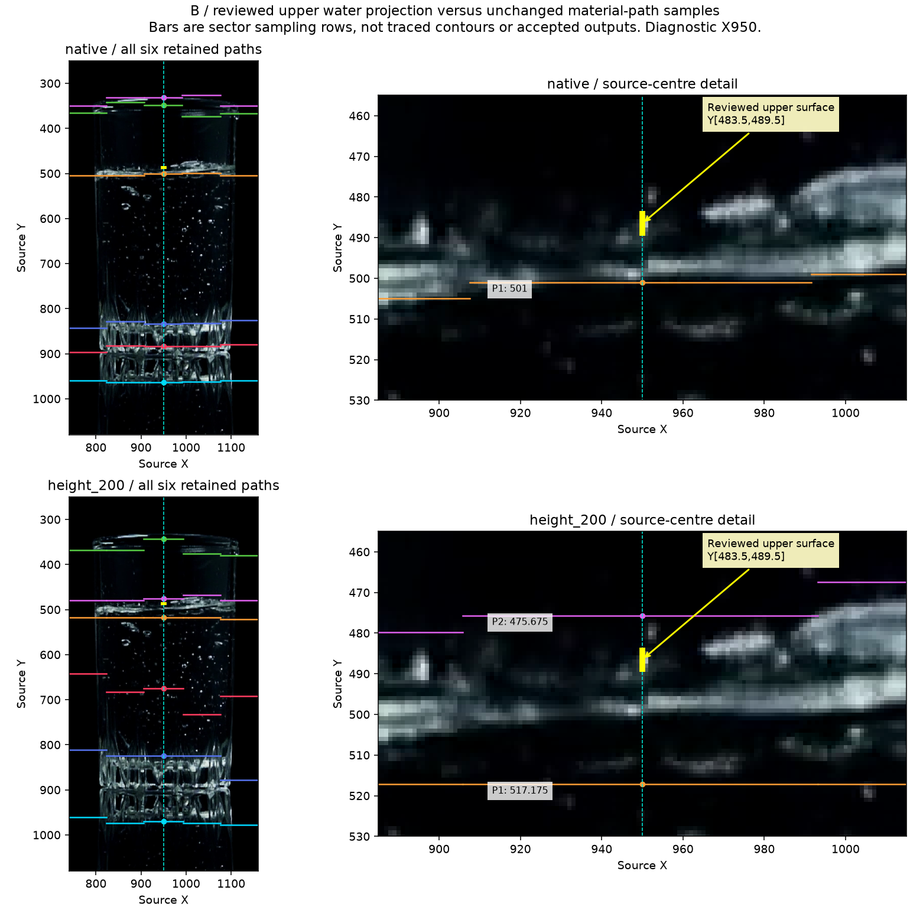

# B reviewed interval: first material-path lane loss

Date: 2026-10-10. Base: `f9737d3caa290b6aee80da2f9e4320b6b1f0f535`.
The [human interval reply](2026-10-10-upper-projection-interval-reply.json)
qualifies B/f1438's upper water projection at diagnostic source X950, within
rows 484–489 / pixel-cell bounds Y[483.5,489.5]. This is one exposed development
reference with uncertainty, not an exact Y, full contour or calibrated height.

**Finding:** the unchanged first material-path lane loses compatibility with
this reference **inside per-seed path optimization, before deduplication or
top-k**. Native and height-200 processing both retain local admissible support
and legal five-sector paths through the reference rows. Neither polarity's
winning path preserves those rows. Increasing the final candidate count cannot
recover what this earlier reduction already discarded.

This is a position/representation finding for one isolated existing lane. Its
sector samples span a band around X950; they are not traced contour pixels.
No accepted Oil/Foam output, physical identity accuracy or whole-application
failure is inferred. Current status and the next source review remain owned by
[Work Plan](../../00-project/work-plan.md).

## Reused entry and frozen scope

The [complete machine record](2026-10-10-b-material-path-interval.json) retains
the preflight written before execution, all inputs/source hashes, both runners,
every original seed path, retained candidate and saved profile array location.
It reuses the [earlier public-path audit](2026-10-09-public-path-representation.md):
`preprocess` → `detect_bottom_connected_foam` raw combined evidence →
`oil_material_path.generate_material_path_candidates`. The actual assembler's
first call uses `bounded_candidate_top_k(default, cap=6)`; the same call and
defaults are used here. No new candidate generator or permanent helper is added.

The frozen crop is [740,250,1160,1080]; the full rectangular mask and preprocessing
glare are unchanged. Native shape is 830×420; the already established reduced
recipe is height 200, width 101, `INTER_AREA`. Source mapping uses actual separate
X/Y scales and pixel centres. No ellipse, static map, local exclusion, zero line,
mm calibration, additional scale or threshold is introduced. B was not one of
the earlier 18 lane-audit rasters; the new results are not presented as a rerun
of that earlier case set.

All seven recordings and the 13 historical scalar cases remain in their existing
scopes. This reference does not label C, neighbouring frames or another material.
It is not an untouched holdout. The alternate raster lane, other candidate
families, complete assembler, tracker, Foam episode and final public projections
are outside this isolated call.

## Complete funnel and first supported loss

| Fixed scale | Original seeds / eligible paths before retention | Retained | Reference-compatible centre samples before / after retention |
|---|---:|---:|---:|
| Native | 33 / 33 | 6 | 0 / 0 |
| Height 200 | 12 / 12 | 6 | 0 / 0 |

All original seeds are inspected, including the diagnostic continuation after
the producer's actual early top-k stop. These later paths are not claimed to
have been generated by the normal call. Exact seed order and deduplication
reproduce the six actual retained paths at each scale. Capture ON/OFF candidates
are identical for both calls.

At native size the centre sector spans source pixel-cell X[907.5,991.5).
All six reference rows have score 0.411–0.466, signed contrast 0.291–0.404 and
support 1.0, satisfying the unchanged local path predicates. Original seeds
255, 243 and 227 cover every reference row inside their ±24 band. The retained
nearby sample is Y501 (its original median candidate Y is 505); these coordinates
are explicitly distinct. The positive-polarity winner instead samples Y495.

At height 200 the centre sector spans X[905.837,993.163); working rows 56 and 57
map to source Y483.975 and Y488.125. They are locally admissible and covered by
original seeds 55 and 62 within ±15. Their positive-polarity winner samples
Y475.675, outside the reviewed interval. Reduced-pixel cell extents are preserved;
neither this sample's centre nor its cell overlaps the reviewed range.

A separate saved-profile reachability preflight then tests the **existing**
global-band, contiguous-sector, adjacent-step, support and polarity constraints.
Every reference row admits a concrete five-sector positive-polarity witness;
all witness constraints are checked. Both unchanged polarity winners are saved.
The first supported loss in this lane is therefore early score-based path
compression, not absence of local profile support, lack of an original seed
band, an impossible path, or the final top-k limit. The witness paths are
diagnostic existence proofs; their side samples have no physical annotation
and are not proposed detector repairs or new candidates.

## Consequence and verification

The representation must keep observed central alternatives until physical role
and projected-branch identity can be resolved. This finding supplies no rule for
that physical selection. A truth-forced path, raw-edge minimum, stronger edge,
larger top-k or wider seed band is not adopted. The existing lossless raw-edge
graph remains available; repeating its closed connectivity/identity experiment
would not resolve this new scalar contract.

The separate [A/C source preparation](2026-10-10-upper-projection-ac-review.json)
subsequently received **“두 범위 모두 맞음”**. Its
[bound reply](2026-10-10-upper-projection-ac-reply.json) closes both upper-position
intervals while A's lower interface stays unclear. The
[later comparison](2026-10-10-abc-source-interval-comparison.md) finds C native
compatibility and preserves B's source-specific causal conclusion. These three
references remain one exposed recording; no general measurement fix follows.

Verification covers pinned inputs/source, capture equality, complete seed
accounting, exact retention, saved-array coordinate/interval enumeration,
reachability witnesses, source figure inspection, links, governance and
whitespace. No production or legacy truth changes, full application replay,
classifier score, Windows execution or field acceptance are included.

## Detector Governance

- Logic-map nodes: `FRAME-EVIDENCE`, `OIL-CANDIDATE`, `FOAM-CANDIDATE`, `OIL-PROJECTION`, `PUBLICATION-PROVENANCE`
- Failure-registry entries: `S11-F02`, `S11-F04`, `S11-F09`, `S11-F10`
- First harmful stage: `_polarity_path_for_seed` winner compression in this isolated material-path lane excludes all reviewed-position-compatible centre samples despite admissible local profiles and legal five-sector paths; whole-pipeline physical recall remains unmeasured.
- Logic-map impact: NONE — the current first material-path owner, optional path sidecar and saved profiles are reused unchanged; no executing route or API is added.
- Failure-registry impact: NONE — this source-bound result distinguishes F02 pre-retention representation loss from capacity loss; F04/F09/F10 still prevent geometry, diagnostic Y or a reviewed coordinate becoming physical authority.
