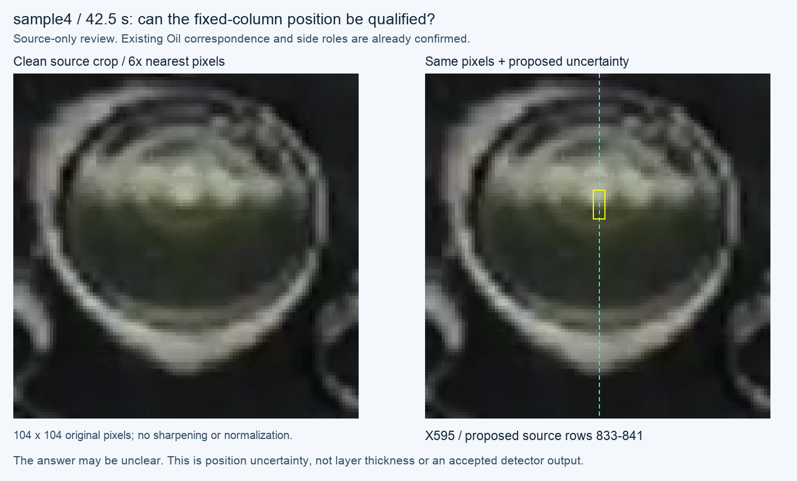

# sample4 fixed-column source-position qualification

Date: 2026-10-10. Base: `725d5b1a710e6c587b268577ccf85b1357b9713d`.
This is one pending source judgment after the
[closed A/B/C interval comparison](2026-10-10-abc-source-interval-comparison.md).
The [Work Plan](../../00-project/work-plan.md) owns the current pause.

## Why this one frame

All three newly qualified references belong to one public drinking-glass video.
The earlier audit established no fixed-centre scalar transfer for the old 13
points. A numerical comparison intended to inform compressor-sight-glass work
therefore needs a separately qualified reference in that domain, while all seven
recordings retain their scoped qualitative and engineering uses.

Sample4 f1275 at 42.5 s already has confirmed Oil correspondence and confirmed
upper bubbly-fluid/lower less-bubbly-liquid context. It is selected on that prior
qualification, not a favourable new detector result. No new candidate is run or
shown. The original 104-pixel Glass diameter also exposes the precision limit
that motivated the user's old-video concern.

The [preparation record](2026-10-10-sample4-center-source-review.json) pins the
source, original ROI, context-origin manifest, Recipe, earlier reviewed roles,
the selected measurement convention and builder. The existing Recipe centre
gives X595. Clean-source inspection proposes inclusive rows **833–841**, cell
bounds **Y[832.5,841.5]**. This is a broad position uncertainty, not an exact Y,
thickness, region mask or approved annotation. Earlier Y835 was already exposed;
this preparation is not blinded or a new holdout.

## Pending question

> sample4의 42.5초 장면입니다. 청록색 중앙선에서 기포가 많은 위쪽 유체와 기포가 적은 아래쪽 액체의 경계 위치를 노란 범위 안으로 판단할 수 있나요? 흐려서 위치 판단이 어려우면 “불명확”으로 남기겠습니다.

An unclear answer keeps this frame qualitative-only for the new scalar task;
it does not withdraw the closed Oil/region judgments or count model abstention
as correct. A yes qualifies only the one position range; a correction requires
an attributed new preparation. No compulsory review of every old coordinate,
replacement truth, new Recipe calibration or Windows task follows.

## Pixel verification

The source PNG is a 168×168 context crop at source origin (511,766), not a full
frame. Translating the requested source crop [543,798,647,902] reproduces the
existing 104×104 ROI byte-for-byte as pixels. The clean figure panel is exactly
6× nearest-neighbour replication. No sharpening, contrast normalization,
interpolation, video decode or detector replay occurs.

The first preparation's pixel-equality assertion rejected a mistaken full-frame
origin before it created a figure. The preserved retry binds the existing crop
manifest and verifies the corrected translation with the same proposed range.
Original source/Recipe/reply hashes remain unchanged. The yellow box width is
display decoration; the review concerns only the existing fixed X595 column.

## Detector Governance

- Logic-map nodes: `FRAME-EVIDENCE`, `OIL-PROJECTION`, `PUBLICATION-PROVENANCE`
- Failure-registry entries: `S11-F04`, `S11-F09`, `S11-F10`
- First harmful stage: converting historical candidate/region correspondence into exact fixed-column truth without qualifying visibility and position would be unsound. This preparation makes no detector-failure or physical-accuracy claim.
- Logic-map impact: NONE — existing source pixels, Recipe centre and reviewed role are reused without a new runtime consumer or coordinate transformation in production.
- Failure-registry impact: NONE — this applies the existing identity/projection/uncertainty boundary; it neither retries a closed mechanism nor declares field repair.
