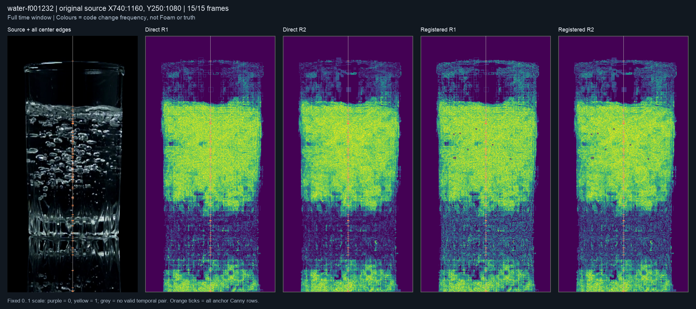
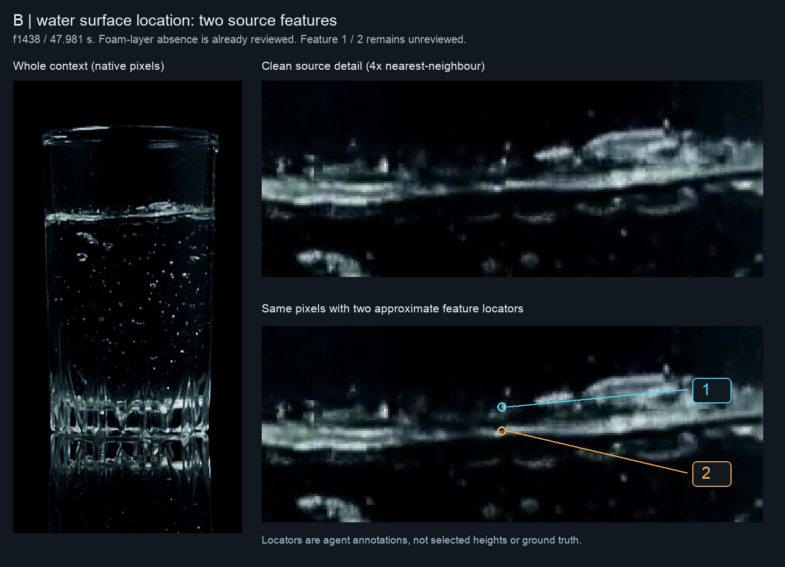

# Ordered temporal texture observation — 2026-10-10

Base: `2a7b63b345212adb92a9ea77fecbb25aa1917003`.

**Result:** the fixed readout is complete, but code-change frequency is not an
independent physical-role observation. A local optical deformation of a fixed
pattern produces the proposed one-sided change. Real source maps expose broad
changing areas, including the water body and glass-pattern context, without
selecting a unique physical boundary. **Cue-only promotion is rejected.** This
does not prove that passive video or every joint mechanism is incapable of the
task. No detector, threshold, Recipe, formal truth or public output changed.

The [machine record](2026-10-10-temporal-texture-observation.json) preserves all
four attempts, exact runners, input pins, independent verifier, figures and
local native archive. The [complete readout](2026-10-10-temporal-texture-readout.json.gz)
retains the original JSON bytes under gzip. Current sequencing and the pending
human checkpoint belong to the [Work Plan](../../00-project/work-plan.md).

**Subsequent source reply:** the user identifies B and C as water surface
without a Foam layer. The [bound reply](2026-10-10-later-water-role-reply.json)
closes their regional-role checkpoint. The source-feature follow-up below
separates that judgment from the relation between two nearby features at B.
The later [B feature reply](2026-10-10-water-surface-feature-reply.json) now closes
that relation as front/back views of one surface; its consequences are recorded
below without changing the frozen preparation or original measurements.

## Question, reuse and frozen scope

The earlier [support audit](2026-10-10-water-foam-representation.md) showed
that A's raw white predicate loses central support despite available edges and
texture. This investigation asks whether **ordered same-coordinate texture
changes** provide additional source information without an absolute-white gate.
It does not repair the mask or assume that change means Foam.

Reuse unchanged `s11_side_texture_probe.texture_maps` for radius 1/2 circular,
bilinear, rotation-invariant texture codes, and the existing temporal raster
owner's `_translation` for neighbour-to-anchor registration. Earlier side
histograms discard chronology and pixel correspondence; earlier pair motion
features summarize brightness residuals. This operation preserves chronological
code transitions and two-step returns, but inherits the existing optical and
motion ambiguity. Neither the old histogram decision nor its operating point
is reused. One-off runners are preserved as evidence, with no new runtime API.

Before source outcomes, fix the ten water anchors 0/205/815/822/829/1225/1232/
1239/1438/1643 and the seven sample4 controls 420/450/480/1620/1635/1665/1680.
Water uses the existing native X[740,1160), Y[250,1080) crop and diagnostic
X950; sample4 keeps its native X[543,647), Y[798,902) crop, existing effective
mask and X595. Water's crop centre is not calibrated Glass geometry. These
are exposed development controls, not independent holdouts.

Each anchor requests offsets −7…+7 at native cadence, using the existing
timestamp/index-bound decoder independently for each frame. Compare both raw
coordinates and neighbours registered to the anchor. Preserve registration
status and actual interpolated visibility; unavailable registration is not
zero motion. This is an offline symmetric window, not a tested real-time or
latency contract.

For each radius and eligible pixel, count adjacent code changes and three-frame
returns, retaining denominators. At **every original central Canny row**, compare
upper/lower near/far bands using the original 5-column strip, 2-pixel gap and
band rule `min(32,max(4,round(min(H,W)*.06)))` (water 25; sample4 6).
Side readouts require the full 15-frame window and all requested pixels across
all 14 transitions. Report
`min(lower_near, lower_far) − max(upper_near, upper_far)` and its upper counterpart
separately for each radius/channel. Positive is descriptive contrast, not a
classifier, chosen contour or scalar. No radius, time window, band or threshold
was selected after outcomes.

## Controls and preserved failed attempts

Eight synthetic control groups cover identical images, affine exposure,
known integer camera displacement/inverse, identical pooled histograms with
different time order, hidden-pixel mutation, absent visibility, local optical
warp and the same observations under different physical interpretations.

The first attempt failed its exact affine-invariance premise **before real
decode**: the unchanged finite-precision descriptor produces two radius-1
changes and zero radius-2 changes over 6,336 valid pair pixels per radius under
unclipped positive affine brightness transforms. Preserve the counterexample;
the exact rounding/interpolation subcause was not separately localized. The
next control checks literal arithmetic, records this nuisance response and
makes no invariance claim. The descriptor itself is unchanged.

The optical fixed-pattern counterexample has zero changes in the selected
unchanged upper region and **2,836** across both radii in the warped lower
region. Thus one-sided renewal alone cannot establish fluid ownership. Synthetic
`PASS` means the stated arithmetic controls and nuisance responses are retained,
not physical discrimination or photometric invariance.

| Attempt | Result and bounded correction |
|---|---|
| 001 | Failed affine premise; counterexample arrays and original runner retained. No real source decoded. |
| 002 | Eight water-start frames decoded, then validation requested `canny` from the wrong saved NPZ. No real texture/registration readout persisted. |
| 003 | Bound the already-existing stage NPZ for Canny/gray/glare equality. Completed 16 cases, then sample4 nominal frame 1682 raised EOF despite metadata. All completed arrays and partial readout retained. |
| 004 | Reused those exact 16 cases, then completed the last case with actual missing frames explicit. Measurement helpers are AST-identical to 003; no completed case rerun or missing-time bridge. |

Attempt 002's original failure note suggested a different field in the support
NPZ; inspection established that Canny lives in a **separate stage NPZ**. Later
preflights record that correction without editing the original note.

## Complete real readout

All 17 original crops and anchor preprocessing match saved evidence. The final
readout contains **235 decoded frame queries**, **877 central edge rows** and
**1,754 channel/row queries**: 1,203 available and 551 unavailable. Unavailability
is 140 truncated-time, 281 incomplete-common-support and 130 censored-spatial
queries. These are diagnostic availability counts, not physical recall/error.

| Source / anchor | Decoded frames | Centre edge rows | Available direct / registered |
|---|---:|---:|---:|
| water 0 | 8 | 29 | 0 / 0 |
| water 205 | 15 | 28 | 28 / 28 |
| water 815 | 15 | 138 | 101 / 100 |
| water 822 | 15 | 122 | 84 / 82 |
| water 829 | 15 | 133 | 100 / 98 |
| water 1225 | 15 | 101 | 93 / 93 |
| water 1232 (A) | 15 | 97 | 93 / 93 |
| water 1239 | 15 | 92 | 39 / 39 |
| water 1438 (B) | 15 | 32 | 32 / 32 |
| water 1643 (C) | 8 | 32 | 0 / 0 |
| sample4 420 | 15 | 15 | 10 / 10 |
| sample4 450 | 15 | 9 | 5 / 5 |
| sample4 480 | 15 | 9 | 6 / 6 |
| sample4 1620 | 15 | 10 | 3 / 3 |
| sample4 1635 | 15 | 9 | 3 / 3 |
| sample4 1665 | 15 | 12 | 7 / 7 |
| sample4 1680 | 9 | 9 | 0 / 0 |

Sample4 metadata reports 1,684 frames. Requested 1682/1683 fail actual decode;
1684…1687 lie beyond metadata. Last-case evidence contains only 1673…1681.
Water f0/f1643 also lack the full symmetric window. Their retained partial
maps are explicitly marked; no complete-side comparison or negative success
is inferred. This finding concerns this reader/runtime, not every possible
decoder. No backend change or frame substitution was attempted.

All 218 measured neighbour registrations pass the existing bounds; 17 anchors
use identity. This does not contradict the earlier **empty-reference→f1438**
registration failure: the current pair inputs are its nearby native frames.
Accepted registration is not a physical correspondence certificate.

At A, the agent's source comparison shows a broad high-change region extending
well below the upper bubbly feature, plus changes around glass structure. The
human-confirmed Foam role does not label this whole heatmap as Foam. Among 93
available registered rows, 22/32 have positive lower contrast for radii 1/2,
while 28/35 have positive upper contrast. The readout therefore does not itself
select one central outline. A's unclear lower boundary remains unscored.

The later B map retains broad change below its narrow bright upper band; C's
partial map is quieter. That visual difference is **not** evidence that Foam
has disappeared. The exact physical role of the remaining band is unreviewed.
The sample4 maps likewise retain changing structure/texture context; no new
pixel labels are assigned to its original regional controls. The optical
counterexample already prevents standalone promotion, irrespective of these
real outcomes.

All cases, including missing support, appear in the fixed-scale overview sheets:
[water 0–829](2026-10-10-temporal-texture-water-1.png),
[water 1225–1643](2026-10-10-temporal-texture-water-2.png), and
[all sample4 controls](2026-10-10-temporal-texture-sample4.png).
Native individual panels are preserved in the local archive. Colours always
mean change frequency in [0,1]; grey means no valid pair. Orange marks include
every central Canny row, not accepted interfaces.

## Source-role checkpoint for the next comparison

The [clean B/C review](2026-10-10-later-water-role-review.png) keeps the existing
B=f1438/47.981 s and C=f1643/54.821 s IDs. It shows source pixels and the exact
previous centre-detail crop, without measurement overlays or contrast changes.
For each, the open question is whether the narrow upper bright band retains a
Foam layer, shows water surface without a Foam layer, or is unclear.

This determines whether later source views can oppose a motion-dependent
Foam rule as **thin/settled-Foam positives**, or provide a **Foam-absence /
qualitative water-surface control**. If unclear, keep the role unresolved. Time
order, lower activity, A's earlier label and detector output cannot supply the
answer. This is a new regional-role question about B/C, not another request for
A's lower coordinate or a microscopic boundary label. It does not reopen the
rejected cue or authorize fitting a new threshold to the answer.

Any later qualified comparison still needs a distinct joint role observation,
predeclared decision/abstention rule, preserved structural opposition and the
beer/milk/target-domain controls before challenger evaluation. No successor
is established here. Existing comparative-filming unavailability and prior
closed judgments are respected; no new acquisition or Windows request follows.

## Later B/C reply and source-feature follow-up

The user answered **“거품층 없이 물 표면이 보임”** to the joint B/C review.
As stated to the user, apply that answer to both displayed frames: B/f1438 and
C/f1643 are now regional **water-surface positives / Foam-layer-absence controls**.
This does not claim the absence of isolated submerged bubbles, label intervening
frames, date the disappearance of A's Foam, or provide exact contours/heights.
A's Foam presence and unclear lower boundary, and f822/beer/milk judgments stay
closed. The previous machine record and all readouts remain byte-identical;
their pending fields are superseded by the separate source-bound reply.

The already-measured broad temporal change in B is therefore real-source
opposition to interpreting renewal as Foam presence. No new classifier or
success/failure rate is derived from that comparison. C's eight-frame readout
still lacks the full symmetric temporal window even though its still-image
regional role is now known. Neither source loses its inventory membership.

Before proposing any numerical surface reference, inspect the **same original
detail crop** at the existing diagnostic X950, separately from a detector.
B shows a faint upper bright feature and a stronger lower band. The saved
Canny column has five rows in that detail (source Y485/488/492/496/500); those
are observed image edges, not five physical interfaces or candidate truth.
Thus presence of water surface does not by itself identify the exact reference
feature, and choosing the strongest/nearest edge would repeat the old oracle
problem. No numeric reference or tolerance has been assigned.

The [preparation record](2026-10-10-water-surface-feature-review.json) pins the
source and the original temporal array. Marker 1 points approximately to the
upper feature and marker 2 to the lower band. Their source XY values are agent
visual locators, not proposed exact truth. The question is whether they are
front/back projections of one water surface, whether only one belongs to that
surface, or whether the distinction is unclear. That answer affects which
feature may become a location reference; it does not automatically choose a
numeric height, error tolerance, Foam thickness or calibrated Glass centre.
This is not a repeat of the closed Foam-presence question or the beer projection
judgment, and no answer transfers from B to C. If unclear, retain both as
unresolved geometry rather than forcing a scalar. The fixed-centre product
choice itself is unchanged.

Both clean review panels equal the pinned native source pixels (the detail is
an exact 4× nearest-neighbour enlargement), and the whole crop equals the saved
anchor array. All preparation inputs remain unchanged. No new media replay,
detector calculation, score fitting or Windows task is required by this review.

## Human reply received — one surface with two projected branches

The user answered **“①·②는 같은 수면의 앞뒤 모습”**. The
[source-bound reply](2026-10-10-water-surface-feature-reply.json) closes B's
physical-relation question: both marked features belong to **one water surface**.
Do not count them as two material interfaces, infer a layer thickness from their
image separation, or label an unrelated edge between them as correct. This is
a regional relation at B/f1438, not an exact contour annotation, a front/back
assignment to each marker, or an answer about C's subfeatures. Both geometries
remain present. B/C Foam absence and all prior replies remain closed.

The reply completes this source-role qualification but does not choose one
height. Responsibility discovery followed the selected fixed-centre contract,
the product's uppermost-physical-interface definition, `GlassGeometry` conversion,
and the existing target-truth binder. Fixed X identifies a column, physical-role
review identifies a surface, and conversion only subtracts an already selected
Y from a zero line. None declares which of one surface's projections supplies
the scalar. The target binder explicitly leaves scalar truth untransferred.

The [architecture proposal](../../20-architecture/s11-interface-observability-witness-architecture.md#same-surface-projected-branches--scalar-convention-pending)
therefore presents a separate measurement-semantics choice: the upper image
projection (recommended for the stated simplicity/consistency preference), the
camera-facing projection, or deferral of the scalar while qualitative work
continues. Choosing a physical surface is not a rule to take the highest raw
edge. Neither projected branch becomes a numeric reference before this choice
and the independent coordinate/precision requirements are satisfied. There is
no new detector trial, repeated B relation question, pixel-label request or
Windows requirement. The Work Plan owns the pending decision and next action.

## Verification and preservation

The independent saved-array verifier checks all 97 bound inputs and 221
production source files; all source crops, effective/glare masks and gray/Canny
preprocessing; every registration warp and contributing visibility; unchanged
texture-owner output; explicit chronological accumulation of changes/returns;
and coordinate-list recomputation of every side band, availability reason and
margin. The 16 reused records equal 003 byte-content at the JSON-object level.
Frame receipts and crop hashes are checked without another video replay.

All four clean review patches (two native, two exact integer enlargements)
equal their source arrays. The native ZIP is read back and each member hash
verified. It contains the full arrays/attempts; its path, size and SHA-256 are
in the Git machine record. Large native arrays/archive remain local and ignored;
Git carries the complete compressed readout, source-bound figures, scripts,
preflights, failures and verification, not a falsely portable native bundle.

Focused document links, governance and whitespace are checked for this change.
No production source changed, so a full application replay is not evidence
needed to verify this isolated diagnostic. No Oil/Foam efficacy or Windows
acceptance is claimed.

## Detector Governance

- Logic-map nodes: `FRAME-EVIDENCE`, `FOAM-CANDIDATE`, `PUBLICATION-PROVENANCE`
- Failure-registry entries: `S11-F02`, `S11-F03`, `S11-F04`, `S11-F07`, `S11-F09`, `S11-F10`
- First harmful stage: standalone physical-role inference would be unsound at texture-change interpretation because fixed-pattern optical deformation supplies the same cue. B/C supply real no-Foam controls and B's two marked features now belong to one reviewed surface; a projected-branch convention and exact observed coordinates are still missing before a numerical truth claim. Actual production first physical failure remains unknown. No classifier or scalar was executed here.
- Logic-map impact: NONE — saved-source observation reuses existing preprocessing, registration and texture owners through one-off evidence runners; runtime callers, Oil/Foam independence and publication remain unchanged.
- Failure-registry impact: NONE — the retained nuisance and optical counterexamples instantiate the existing temporal/appearance-identity limitations; no accepted mechanism or new runtime gate is introduced.
