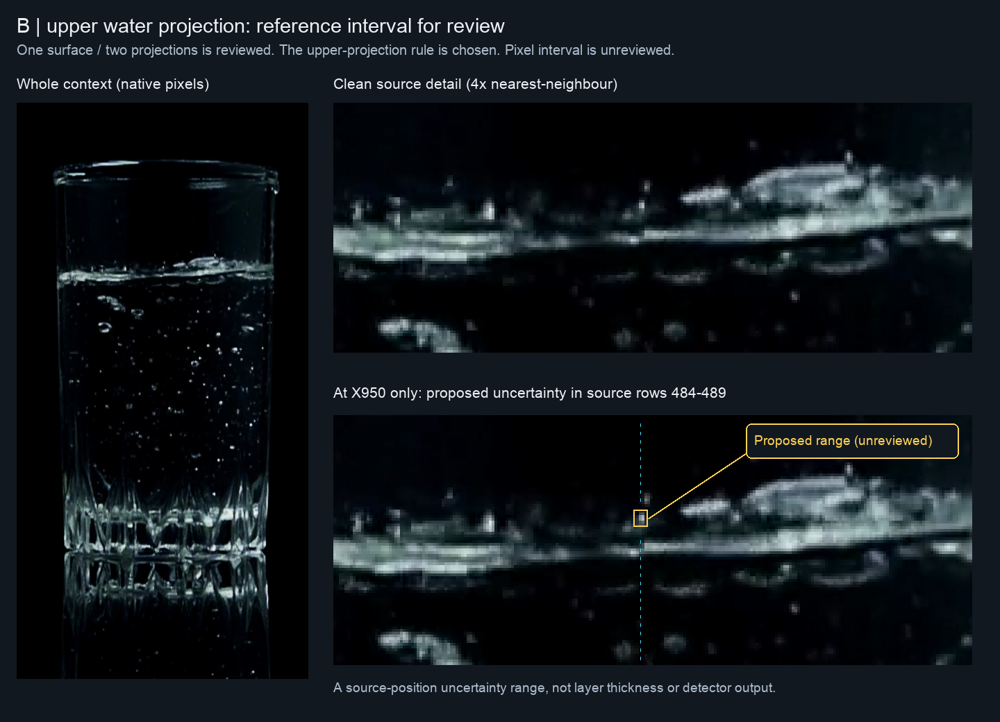
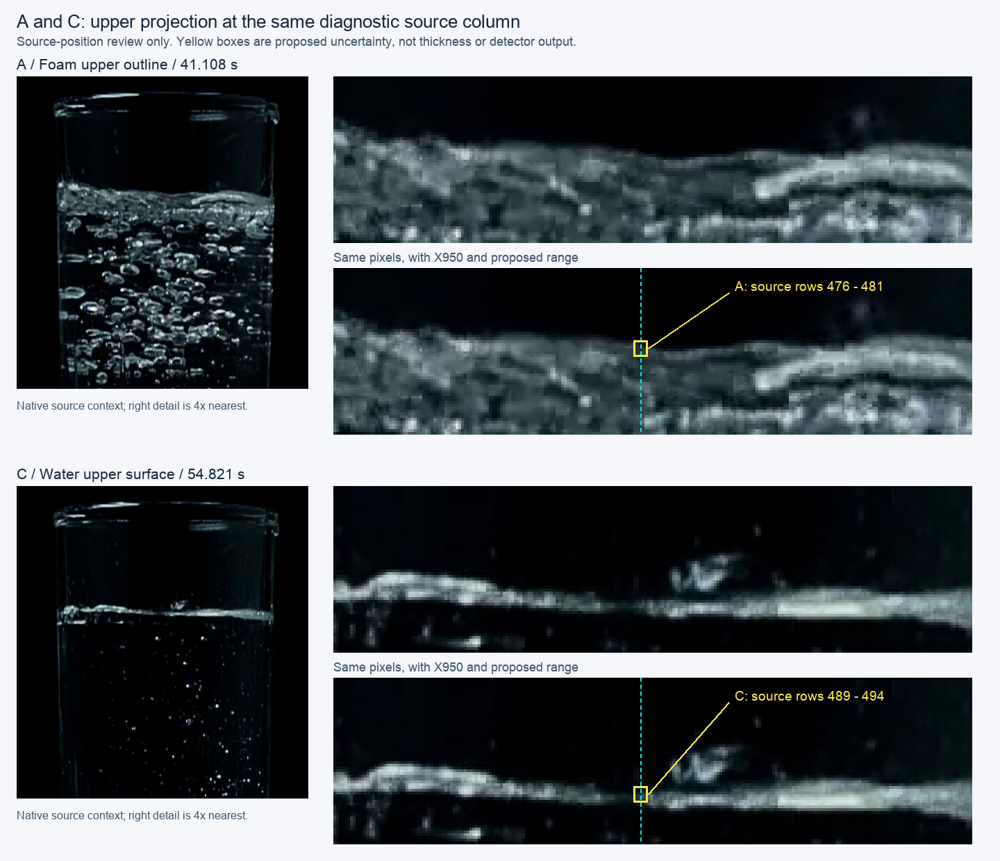

# Upper-projection choice and source-reference qualification — 2026-10-10

Base: `f9737d3caa290b6aee80da2f9e4320b6b1f0f535`.
The user answered **“권장안으로 가자”**, selecting the recommended upper image
projection at the existing fixed column. The [bound choice](2026-10-10-upper-projection-choice.json)
closes that product decision; the [architecture](../../20-architecture/s11-interface-observability-witness-architecture.md#same-surface-projected-branches--upper-image-projection-selected)
owns its exact meaning. This is a measurement target for the offline challenger,
not a physical selector or runtime adoption. The [Work Plan](../../00-project/work-plan.md)
owns the next transition.

## Reuse and concrete consequence

The existing geometry conversion already consumes an eligible observed Y. Saved
edge rasters and `s11_foam_support_geometry` face arrays already preserve column
intersections. A two-condition array query is sufficient for this source audit;
no new extractor, duplicate projection helper or production caller is needed.
The closed CBR-1 appearance selector is not reopened by taking an upper crossing.

Physical target identity still precedes projected-branch selection. A clearly
identified single upper projection is allowed; a two-arc shape is not required.
Missing or ambiguous upper support does not fall back to the lower projection,
another column, a mean or a carried height. Independent Oil/Foam roles and the
uppermost-actual-fluid-interface target remain separate responsibilities.

The first preparation used **only the reviewed B/f1438 source** at 47.981 s.
The user subsequently answered **“표시한 범위로 맞음”**, approving the displayed
position-uncertainty range. The [separate bound reply](2026-10-10-upper-projection-interval-reply.json)
closes that review; the original preparation/image remain unchanged. C and all
other water/beer/milk/target cases keep their independent qualifications; no
scene or legacy case is removed from later evaluation.

## Frozen source proposal and retained observations

The [machine record](2026-10-10-upper-projection-reference.json) embeds the
preflight and exact runner, hashes the source/replies and previously saved native
arrays, and retains the complete column readout. No video is decoded or detector
executed again. The existing diagnostic crop is X[740,1160), Y[250,1080), with
X950 as its centre. This is **not calibrated Glass geometry**; no zero line or
mm/px scale is assigned.

The proposed uncertainty covers source pixel rows **484–489**, with continuous
row-cell bounds **Y[483.5,489.5] at X950**. The half-pixel endpoints describe pixel
cells, not subpixel physical accuracy. This is uncertainty about the location of
one upper-projection intersection, not a six-pixel-thick layer, a dense contour
mask, or approval of unrelated edges between the bounds. Its authority is
**agent source-visual proposal in the frozen preparation**, subsequently
**human-reviewed position uncertainty** in the separate reply.

The interval comes from direct native-source inspection. The earlier Canny rows
were already exposed, so this is not blinded annotation or a holdout. No detector
prediction, residual or performance result was used to fit an error tolerance.
The interval can now support scoped positional-compatibility diagnostics. It
is not a midpoint point label, automatically accepted physical prediction or
revision of `.oiltruth`. The reply does not extend precision beyond the range.

| Unchanged saved observation at X950 | Readout | Interpretation |
|---|---:|---|
| All raw Canny rows | 32 | Multiple available image edges; no physical selection |
| Canny rows inside the proposed range | 485, 488 | Two available pixels, neither certified as an exact physical contour |
| Retained appearance-face crossings | 885.5, 890.5 | Both outside the proposed surface interval; these are appearance boundaries, not Oil/Foam outputs |
| Glare rows inside the proposed range | None | No glare censorship there in this saved capture; not identity evidence |

The retained appearance here came from the isolated Foam owner in the prior
audit. B is a no-Foam control, so its lack of Foam support at the water surface
is **not a new Foam miss**. It only prevents silently reusing those perimeters
as a complete liquid-surface coordinate source. A raw-edge minimum would also
select Y331, not the reviewed surface vicinity. Neither an uppermost appearance
face nor an uppermost raw pixel implements the newly chosen physical-target rule.

## B review closed; next A/C source qualification

The targeted B answer confirms that the upper water-surface intersection at the
cyan column lies within the small yellow box. It does not reopen Foam presence,
the one-surface relation or the measurement convention. The [existing-lane audit](2026-10-10-b-material-path-interval.md)
then uses this scoped reference and finds early path compression before top-k;
a sector sample remains distinct from an observed contour or selected scalar.

The next [A/C preparation](2026-10-10-upper-projection-ac-review.json) shows native
source context, clean 4× details and the same detail with proposed ranges:

| Source | Already closed physical judgment | New position proposal at X950 |
|---|---|---|
| A/f1232, 41.108 s | Foam layer; separate lower boundary unclear | Upper Foam outline: rows 476–481 / Y[475.5,481.5] |
| C/f1643, 54.821 s | Water surface without a Foam layer | Upper water projection: rows 489–494 / Y[488.5,494.5] |

Both ranges come from independent clean-source inspection, without a new
candidate result or fitted tolerance. They remain **unreviewed**. They extend
source qualification beyond one B point and distinguish the upper Foam and
water roles; two stills from one recording are not independent recordings or
holdouts. An unclear answer leaves that scalar reference unresolved, with no
absence/abstention success. No answer about A's lower interface, B's existing
range, physical thickness or adjacent frames is requested again.

## Verification and boundary

Both clean panels equal the original source pixels: the whole context is native
resolution and the detail is exactly 4× nearest-neighbour. The source crop equals
the previously saved capture, and the saved stage labels equal its retained
labels. Input hashes are unchanged. A separate direct column/label-neighbour
enumeration verifies the retained edge rows and support crossings. Focused source,
link, governance and whitespace checks cover this documentation/evidence change;
unchanged production code requires no application replay for this preparation.

The A/C clean context/detail panels also match their pinned source crops and
exact 4× nearest-neighbour enlargements. No detector executes for their preparation.
The B reply qualifies one numerical uncertainty interval only; no classifier,
efficacy metric, physical thickness, new setting or field acceptance is produced.
The next A/C source judgment is local; no Windows task or new filming is required.

## Detector Governance

- Logic-map nodes: `FRAME-EVIDENCE`, `FOAM-CANDIDATE`, `OIL-PROJECTION`, `PUBLICATION-PROVENANCE`
- Failure-registry entries: `S11-F02`, `S11-F04`, `S11-F07`, `S11-F09`, `S11-F10`
- First harmful stage: scalar qualification would be unsound if the chosen upper-image convention promoted an unreviewed marker or raw/appearance minimum to physical truth. B now has source-bound position uncertainty, while A/C proposals remain unreviewed and an automatic physical selector remains unqualified; this source preparation makes no runtime first-failure claim.
- Logic-map impact: NONE — existing saved rasters, support-face geometry and coordinate conversion are reused without a new API or runtime consumer.
- Failure-registry impact: NONE — the source readout instantiates existing representation/identity/provenance limits; it neither retries a closed selector nor claims a new physical failure.
