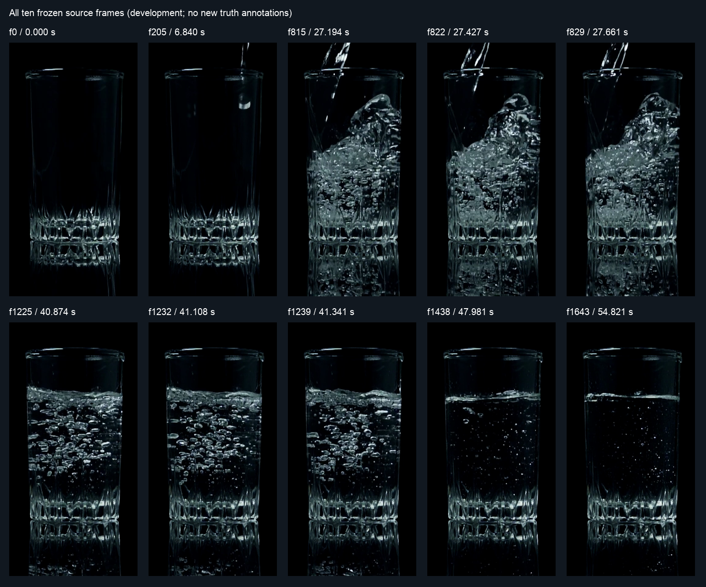
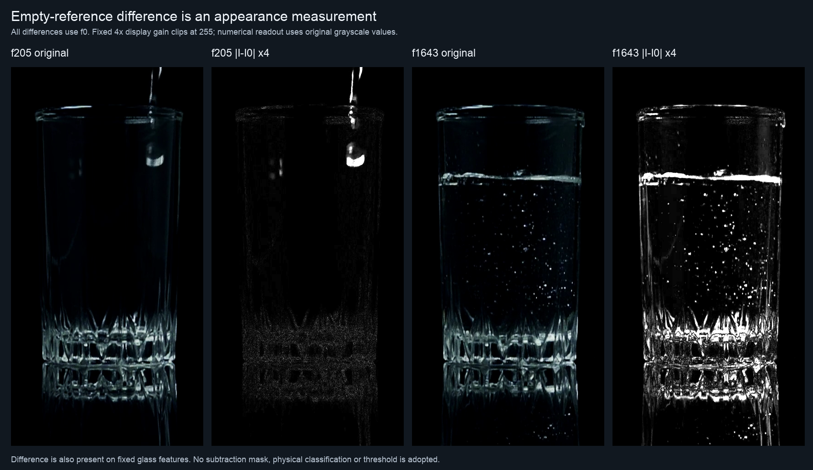
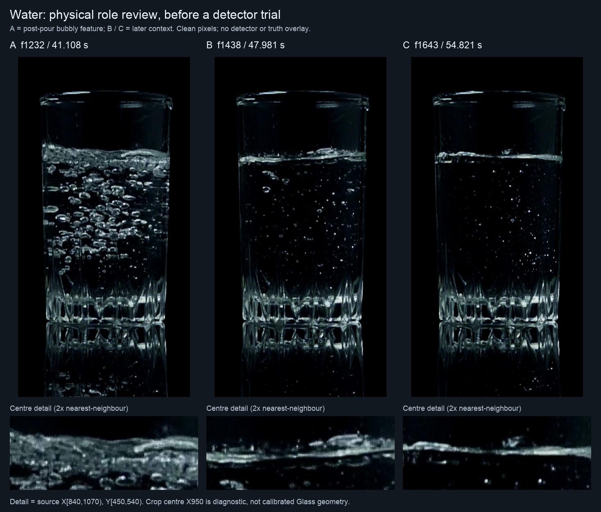
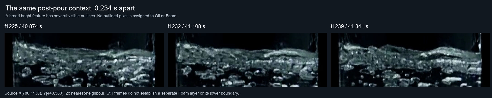

# Water-first source qualification — 2026-10-10

Base: `c196c40dddeb6b725b7df47a416804a8b19c266f`.
This is the first bounded step after the
[truth audit](../../60-evidence/s11/2026-10-10-local-truth-and-evaluation-audit.md).
It freezes ten exposed sample5 frames, inspects their physical-role limits and
reuses the existing residual probe. The
[machine record](2026-10-10-water-first-source-qualification.json) preserves
preflight, source pins, all results, qualification corrections and exact scripts.
The [Work Plan](../../00-project/work-plan.md) owns the next transition.

**Finding:** the proposed water development context is useful, but it is not a
uniform empty/settled truth set. F205 already contains an entering stream;
f1225/f1232/f1239 contain a broad bubbly, rippling feature whose Oil/water versus
Foam role was not independently reviewed at this checkpoint. No detector trial
or accuracy claim ran in this source qualification. The subsequent user reply
below closes the question for A/f1232 as a Foam layer.

## Frozen cases and qualification

All ten cases use unchanged `sample/sample5.mp4`, SHA256
`8c5d2708d602bfb5b1d6f8ff12757255a86d607caf6914b153ea6e39c4457e79`,
1920×1080 at 30000/1001 fps. Reuse the existing native crop
X[740,1160), Y[250,1080); the machine record distinguishes full source PNGs
from saved crops and records their origins. No video was decoded again.
X950 is the existing **diagnostic crop centre**, not a calibrated Glass centre.
No Recipe, physical contour, numeric tolerance or `.oiltruth` is created.

| Frames / nominal playback time | Qualified use | Unresolved or prohibited inference |
|---|---|---|
| 0 / 0 s | Empty-looking same-scene rim/base context; reference for this diagnostic only | No dense structure mask or canonical EMPTY phase |
| 205 / 6.840 s | Entry/structure mixed context: an entering stream/droplet is visible | Not a whole-frame empty negative or clean empty reference |
| 815, 822, 829 / 27.194–27.661 s | Inclined-surface context; retain the existing f822 qualitative user reply | No transferred neighbour labels, exact contour, speed limit or Foam-absence truth |
| 1225, 1232, 1239 / 40.874–41.341 s | Broad bubbly upper feature; the later reply identifies A/f1232 as a Foam layer | Neighbours remain context; no exact upper/lower contours or calm water-only boundary follows |
| 1438, 1643 / 47.981, 54.821 s | Comparatively settled, narrower surface-region appearance | Agent-provisional context, not certified Foam-free or numeric fixed-centre truth |

The frozen preflight initially grouped f205 as `empty_context`. The subsequent
source inspection corrects that grouping in `source_qualification`; the original
preflight is retained, not silently rewritten. F205 was **never** used as the
reference or a classifier-negative label in the measurement. F0 was the sole
reference. All cases and outputs remain present. The correction therefore does
not remove a failing prediction or change any performance denominator.

These are finite development observations, not continuously annotated 0–6.84 s
or 41–55 s windows and not independent holdout. The prior f822 reply remains
closed at its original regional scope. Beer/milk and qualified target-domain
controls remain required after a concrete water hypothesis is specified.

## Empty-reference observation, without a new classifier

Responsibility discovery found
[`s11_boundary_temporal_probe.measure_pair`](../../../tests/diagnostics/s11_boundary_temporal_probe.py)
and its production registration/exposure primitives. Reuse its four grayscale
residual views on the full crop: direct, exposure-only, registered and registered
with exposure correction. All four share the owner's common support. There is
no material/glare mask or independently verified camera transform here.

The preflight fixes f0 versus each of the other nine frames, four illustrative
context rectangles, all channels and the unavailable policy. Rectangles describe
image context; they are not homogeneous material masks, candidate supports or
truth. A separate raw full-crop absolute difference is retained for display even
when the existing registration is unavailable. It does not rescue that result.

| Current frame | Upper rim | Upper interior | Surface-activity region | Patterned base |
|---|---:|---:|---:|---:|
| 205 | 2.44 | 1.30 | 2.09 | 4.24 |
| 1232 | 4.27 | 1.05 | 44.79 | 22.34 |
| 1438 | 4.88 | 1.04 | 16.55 | 23.46 |
| 1643 | 4.54 | 1.16 | 10.98 | 23.46 |

Values are mean absolute raw grayscale changes from f0, in 0–255 intensity
units, **not** contour errors or physical probabilities. The named regions have
different content/areas. In the last frame the base-pattern region changes more
than the surface-activity region; upper-rim changes also remain visible. This
supports retaining empty-frame comparison as context, not promoting changed
pixels to fluid or absent matches to non-structure. It does not establish which
changes are caused by refraction, illumination, compression or other effects.

The existing owner measures **8/9 pairs**. At f1438 both translation directions
exceed its unchanged bound: the forward estimate is approximately (+21.446,
−0.709) px against a 14.7 px maximum. Its four common-support residual maps stay
unavailable/NaN, not successful zero change. The raw display remains separate.
No shift bound, region, exposure model or threshold was adjusted after results.
An accepted registration on the other frames is not proof of camera alignment.

## One material-role review before the next comparison

**Original question (closed by the reply below):** A (f1232, 41.108 s)의 밝고 두꺼운 부분을
**잔물결·기포가 있는 물 표면**으로 보는지, **별도 거품층**으로 보는지?
영상만으로 구분하기 어렵다는 답도 가능하다. B/C are later context, not an
assumption that they share A's exact material state.

The agent initially leaned toward ripples/bubbles on the water surface but could
not certify the absence of a separate Foam layer from these stills. The distinction changes
which role a future upper outline may support: water/air versus Foam/air, with
a separate lower interface only if actually visible. Treating the broad bright
feature as already approved water truth would repeat the oracle assumption that
the user asked to question. No exact pixel tracing, front/back convention,
numeric tolerance or repeated fixed-centre product choice is requested.

This is a different frame/role question from the closed f822 inclined-water
reply and the closed beer/milk questions. The question does not reopen the
legacy base f156 dispute or require Windows execution.

## Human reply received — Foam layer at A

The user answered **“A는 거품층이야”**. The
[source-bound reply](2026-10-10-water-foam-role-reply.json) identifies the broad
bright feature in A/f1232 as a **Foam layer**, superseding the agent's water-only
inclination and closing this physical-role question. A is a regional
Foam-containing positive; its upper feature must not be treated as an approved
water–air interface. The original machine record's pending/provisional fields
remain preserved history, with this reply supplying the later interpretation.

Layer presence does not establish exact Foam–air or water–Foam contours,
visibility of both at X950, physical thickness or calibrated centre truth.
Do not assign every bright pixel/component to Foam or propagate A's label to
f1225/f1239, B/f1438 or C/f1643. Upper and lower boundary availability must be
examined independently. The f822 water, beer and milk replies remain closed.
No repeated A material-role question or pixel-label request follows.

The subsequent [retained-support and stage readout](2026-10-10-water-foam-representation.md)
uses all ten fixed frames and locates A's central appearance-support loss in the
existing raw white predicate. The later
[lower-interface reply](2026-10-10-water-lower-interface-reply.json),
**“아래 경계는 불명확”**, closes that separate visibility question. Keep A as a
regional Foam-presence positive and lower-interface unavailability control;
do not assign a lower liquid coordinate or infer layer thickness. Neighbours
and B/C retain their original scope. Both A questions are closed.

## Verification and checkpoint

An independent saved-pixel verifier checks **17 input pins, all ten source
cases, nine raw pairs, 32 available owner-channel maps and 36 region readouts**.
It reconstructs the declared transforms/arithmetic from saved parameters;
it does not independently certify the fitted transform or physical interpretation.
F1438's unavailable state is explicitly checked. All 13 source-image regions
in the three main figures match their native crop or exact 2× nearest-neighbour
expansion; the difference display uses its frozen 4× gain. The all-case sheet
is a separately hashed, reduced overview. All four sheets were inspected.

Preflight/readout/verification, scripts and nine compressed arrays remain in
`sample/output/s11-water-first-20261010-001/` and are pinned by the tracked
record. The record embeds the scripts and receipts; tracked figures allow
review without local video assets. Raw arrays/media still require the local
inputs; a fresh clone does not supply them. Reproduction runs the saved runner
from the repository root into a fresh output location.

The source qualification/readout is complete, with A's regional Foam role now
reviewed. Exact target geometry and a distinct successor decision rule remain
unestablished. Production, existing labels and
evaluation tools are unchanged. This is a source observation, not another
failed/promoted detector variant, a local efficacy PASS or Windows qualification.

## Detector Governance

- Logic-map nodes: `FRAME-EVIDENCE`, `OIL-PROPOSAL`, `FOAM-CANDIDATE`, `PUBLICATION-PROVENANCE`
- Failure-registry entries: `S11-F02`, `S11-F03`, `S11-F04`, `S11-F07`, `S11-F09`
- First harmful stage: NOT_EVALUATED for a detector; source-role assumptions could misqualify f205 as a whole-frame negative or post-pour brightness as a water-only positive before candidate evaluation. Existing pair registration is unavailable at f1438, with the raw display kept separate.
- Logic-map impact: NONE — existing offline residual and production math owners are reused without modification, new consumers or runtime authority.
- Failure-registry impact: NONE — no new physical selector was tested; the observed source ambiguity and appearance/registration limitations preserve existing guards rather than closing a new detector mechanism.
