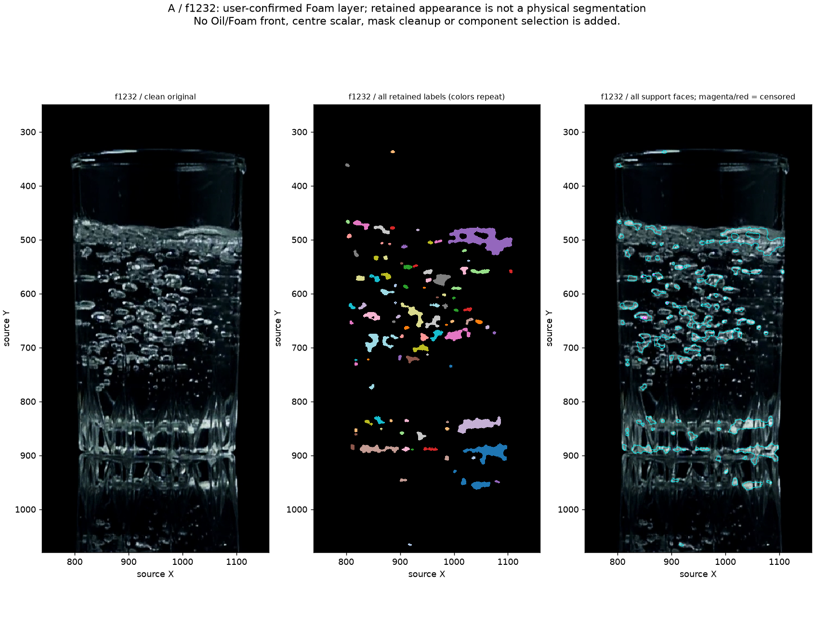
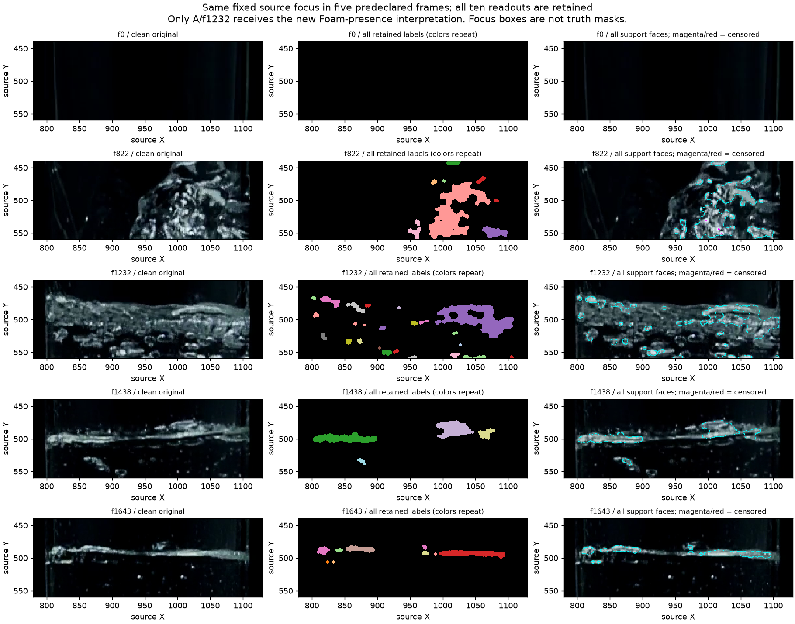
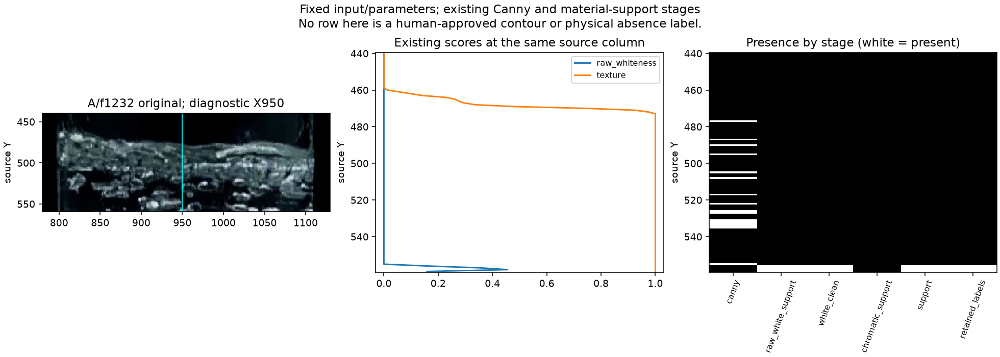

# Water Foam role and retained-support readout — 2026-10-10

Base: `785579119d25ff83486e52a2b0e967cf9b111111`.
The user answered **“A는 거품층이야”** to the
[water source review](2026-10-10-water-first-source-qualification.md#human-reply-received--foam-layer-at-a).
The [bound reply](2026-10-10-water-foam-role-reply.json) closes the material-role
question for the displayed A/f1232 feature as a **Foam layer**. It supersedes
the agent's water-only interpretation, not the original images or measurements.

**Result:** existing retained appearance fragments that layer, and its perimeter
does not supply a central outline near the displayed upper feature. In the
fixed central context, absence starts in the raw white-material predicate:
the existing absolute-lightness floor clamps whiteness to zero despite available
Canny edges and strong texture. Cleanup and later component selection do not
cause that particular missing support. This is a bounded isolated-owner finding,
not full-application accuracy or a reason to lower the threshold.

The [machine record](2026-10-10-water-foam-representation.json) retains all inputs,
scripts, summary results, stage samples and verification. The
[complete component readout](2026-10-10-water-foam-support-readout.json.gz) is
gzip-compressed without changing its original JSON bytes. The
[Work Plan](../../00-project/work-plan.md) owns the next transition.

## Role scope and fixed execution

A/f1232 at 41.107733 s is now a **regional Foam-containing positive**, not an
approved water–air boundary. Foam presence does not certify two visible
interfaces, exact contours, layer thickness or scalar accuracy. The new reply
does not label f1225/f1239, B/f1438, C/f1643, every bright pixel or any component
ID. The prior f822 inclined-surface, beer projection and milk lower-visibility
replies remain at their original scope.

Use all ten previously fixed native water frames and the unchanged diagnostic
crop X[740,1160), Y[250,1080). X950 remains a diagnostic crop centre, not a newly
calibrated Glass centre. All frames are exposed development data. No Recipe,
`.oiltruth`, evaluation schema or production algorithm changes.

Reuse the earlier exact captures for f0/f822/f1643 after checking settings,
source-crop equality and **221 production source pins**. For the other seven
frames, use unchanged `preprocess` and isolated `detect_bottom_connected_foam`
with the same full rectangular mask and default settings as that earlier audit.
Capture ON/OFF agrees on every non-diagnostic result field for all seven new
captures. This is not the full application, calibrated ellipse, Oil assembler,
temporal gate, episode resolver or final public output.

Reuse `s11_foam_support_geometry.measure_boundary_faces` for every retained
label, hole and censored neighbor, retaining all intersections at X950. No
component merge, hole fill, top/bottom pairing or winning front is added.
Label IDs/ranks remain frame-local appearance descriptors, not physical owners.

| Frame | Capture | Retained components | Oriented faces | All X950 crossings |
|---|---|---:|---:|---:|
| 0 | reused | 29 | 2,324 | 4 |
| 205 | new | 31 | 2,518 | 4 |
| 815 | new | 113 | 8,140 | 20 |
| 822 | reused | 100 | 8,884 | 18 |
| 829 | new | 96 | 8,110 | 20 |
| 1225 | new | 95 | 6,388 | 4 |
| 1232 | new | 101 | 6,306 | 14 |
| 1239 | new | 87 | 5,834 | 16 |
| 1438 | new | 29 | 2,916 | 2 |
| 1643 | reused | 37 | 2,936 | 2 |

No capture is truncated. These are representation counts, not physical recall,
false-positive rates or accepted Oil/Foam coordinates.

At A, support appears in parts of the reviewed layer and in internal bubbles
and glass features. The largest upper-region component shown on the right has
source bbox [989,477,1109,529), so it does not reach X950. At that column the
first retained crossing in the predeclared Y[440,560) focus is 555.5; none
represents the visually apparent upper outline near the middle of the image.
This last physical comparison is agent visual interpretation, not an exact
human-approved contour or a numerical miss distance.

## Causal stage readout

A follow-up freezes the same ten frames, focus rectangle and column before
reading earlier masks/scores. A Python return-event observer copies local arrays
from the **unchanged** Foam owner and its raw chromatic helper. It neither
replaces functions nor implements another support rule. Every traced retained
label raster and complete component diagnostic dictionary equals the preceding
capture; inputs remain byte-identical.

For A, source X950 over the fixed Y[440,560) context contains:

| Existing stage | Present pixels at X950 | Meaning |
|---|---:|---|
| Canny | 16 | Raw edges remain; not every edge is a physical boundary |
| Glare mask | 0 | This central loss is not glare censorship |
| Raw white support | 4, at Y556–559 | No white-material support through Y555 |
| Cleaned white support | Same four rows | No cleanup removal or addition at this column in A |
| Raw/final chromatic support | 0 | White-priority arbitration is false and hides no such support here |
| Compact-bright recovery | 0 | No recovery at this column |
| Final support / retained labels | Same four rows | The central gap exists before component ranking |

The existing `_whiteness_score` uses a Lab lightness floor of **125**. At this
column, Y440–555 has maximum Lab L **119**, so whiteness is exactly zero there.
Texture reaches 1.0 in the layer vicinity, but the current white-support predicates
also require nonzero whiteness. Neither available edges nor texture can pass
that conjunction. The four surviving rows at the bottom of the fixed focus
belong to lower appearance support, not an accepted upper/lower target.

All other frames remain in the stage record. Cleanup does remove/alter some
other frames' support, so A's specific explanation must not be generalized to
every case. Strong changes on glass were already established in the source
readout; raw edges/texture alone likewise do not establish Foam. Do not lower a
global brightness threshold, relax episode gates, fill the gap, move X or copy
a side fragment to manufacture a centre measurement. A future boundary/role
measurement must account for the available raw geometry and independent structure
opposition, rather than assume white-mask perimeters are complete physical fronts.

## Lower-interface visibility review — closed

The agent can distinguish A's upper air-to-layer outline regionally, but several
arcs/cells/bubbles crowd its lower side. The Foam-presence reply does not establish
which, if any, is a separately observable water–Foam boundary. This matters before
using this same frame as an **Oil/liquid-interface positive** as well as a Foam
positive. The existing beer front/back reply also prevents inferring two material
interfaces merely from two vertically separated outlines.

The separate question used the same clean A image: **거품층 아래쪽의
물–거품 경계도 눈으로 구분되는가, 아니면 아래 경계는 불명확한가?**
The user answered **“아래 경계는 불명확”**. The
[source-bound visibility reply](2026-10-10-water-lower-interface-reply.json)
closes this question. The original machine record's `PENDING` field is preserved
as history; this later reply supplies the visibility judgment.

| Claim at A/f1232 | Qualified use after both replies |
|---|---|
| Foam layer is present | Human-confirmed regional positive; keep it in the inventory |
| Lower water–Foam boundary | Human-reviewed as unclear; no lower-coordinate error score or invented line |
| Upper Foam–air outline | Agent-observed regional context; not an exact human-approved contour or scalar |
| Layer thickness | Unavailable: a visible-looking upper outline cannot supply the unclear lower boundary |
| Foam absence / correct model abstention | Neither follows from the unclear lower boundary |

This is visibility uncertainty, not physical absence or proof that every optical
method must fail. It does not label neighbouring/later frames, approve every
retained appearance component or turn diagnostic X950 into calibrated geometry.
A remains useful for Foam-presence/representation investigation and independent
lower-interface unavailability. The f822 inclined-water interpretation supplies
separate qualitative liquid-surface context at its existing scope; it is not
silently transferred into fixed-centre numeric truth.

Both A questions are now CLOSED. No exact-pixel drawing, repeated f822/beer/milk/
base f156 question or Windows work is required to complete source qualification.
The reply changes evidence eligibility, not detector outputs or measured accuracy.

## Verification and retained artifacts

An independent saved-array verifier enumerates every observed label pixel and
four-neighbour face without calling the boundary helper. It verifies **718
components, 54,356 faces, 104 centre crossings and 2,872 component/context
readouts** across all ten cases. It checks source-crop equality, source/array
hashes, coordinate/censorship semantics, stage counts and the unchanged whiteness
and raw-support arithmetic. These checks certify the computation, not physical
contour membership. All three figures were inspected.

The initial runner used `normal_xy` instead of the existing `outward_normal_xy`
field and stopped on the first reused f0 case, before any new capture. Its
preflight, runner, first array and error record remain in local attempt `001`.
Attempt `002` corrects only those field accesses and the output directory;
inputs, settings and geometric rules are unchanged. No failed physical outcome
was repaired or dropped.

Local arrays and full native receipts remain under
`sample/output/s11-water-foam-support-20261010-002/`, including `stages/`.
The tracked record pins them and embeds capture/stage/verifier code; the compressed
readout preserves all component details. Raw media/arrays are not supplied by a
fresh clone. Original qualification JSON and old/new truth files remain intact.
This checkpoint establishes a source-bound representation limitation, not a new
detector, efficacy PASS or field acceptance.

## Detector Governance

- Logic-map nodes: `FRAME-EVIDENCE`, `FOAM-CANDIDATE`, `PUBLICATION-PROVENANCE`
- Failure-registry entries: `S11-F02`, `S11-F04`, `S11-F07`, `S11-F09`, `S11-F10`
- First harmful stage: in the isolated A/f1232 native-crop central context, the existing absolute-lightness white predicate already supplies no material support through Y555, despite Canny/texture evidence; retained perimeters cannot recover that missing support. Exact contour recall and full-application first loss remain unmeasured.
- Logic-map impact: NONE — existing owners and saved captures are reused; no production changes, alternate helper or integration consumer is introduced.
- Failure-registry impact: NONE — this adds a source-bound instance of the existing F02 representation and F07 material/front distinction, without testing a new failed selector or altering the no-repeat rules.
